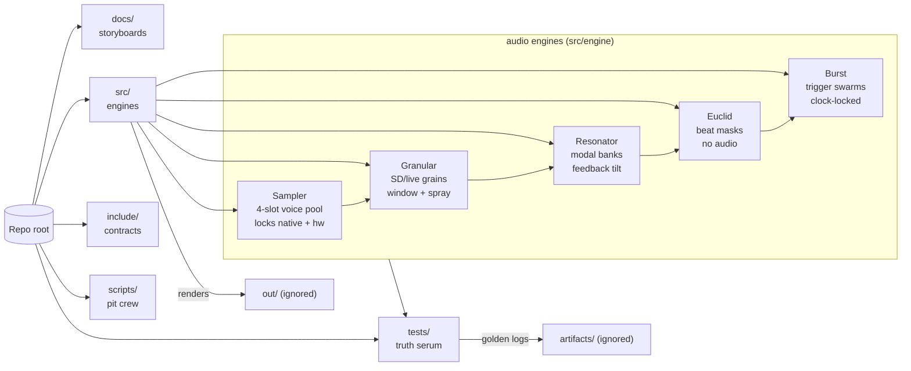
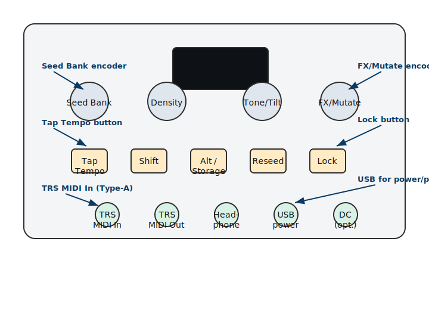
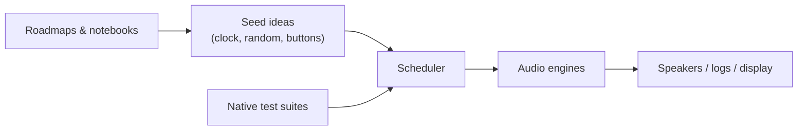
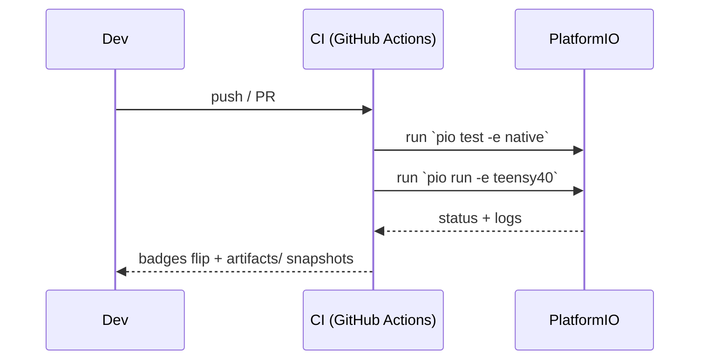

# SeedBox — playground for seeds, sound, and experiments

| Status board | Signal |
| --- | --- |
| CI (native + Teensy) | [](https://github.com/bseverns/seedBox/actions/workflows/ci.yml) |

> 🔏 Fresh pull? Every published `native_golden.tar.gz`, `seedbox-linux-host.tar.gz`, `seedbox-macos-universal.tar.gz`, and `seedbox-windows-host.zip` ships with a detached sig from key `4473F115745A1A61`. [Skip the scroll and verify right away](#signed-bundles-so-you-can-trust-the-receipts): `gpg --verify seedbox-linux-host.tar.gz.sig seedbox-linux-host.tar.gz`.

SeedBox is a tiny music lab wrapped in C++ and wild ideas. Think of it as the
companion project to the MOARkNOBS mythos: a Teensy(IMXRT1062)-based instrument that can
also run a "pretend hardware" build on your laptop. You can poke at rhythm
engines, reseed algorithms, or display sketches without needing a soldered rig.

## Why you might hang out here

- **You like sound experiments.** Sequencers, granular dreams, happy accidents —
  they all live under one roof.
- **You learn by building.** The repo doubles as a studio notebook, so every
  folder tries to teach what it's doing.
- **You want a friendly start.** No gatekeeping; just enough tooling to get the
  firmware compiled and the tests humming.

## Quick orientation



The `Source → engines` branch in that map hides a whole cabinet of sound toys.
Seeds themselves are tiny genomes: pitch, envelope times, tone tilt, panning,
engine choice, and any per-engine extras (grain spray, resonator bank, etc.)
live on the `Seed` struct, so every reseed literally rewrites the score a voice
will follow.【F:include/Seed.h†L12-L46】 You mint those seeds three ways:

| Prime mode | How to grab it | What changes | Why it matters |
| --- | --- | --- | --- |
| **LFSR** | default state, or reseed from the Seed page | Spins a deterministic xorshift genome for every slot. | Great for "roll the dice" jams that still round-trip through presets and tests. |
| **Tap tempo** | flip the prime mode, then tap a BPM in from the front panel or MIDI | Density/jitter lock to your tapped tempo while the rest of the genome rerolls. | Lets workshops teach groove control without touching code. |
| **Preset** | load a curated bank, then reseed in preset mode | Copies stored genomes (tone, pitch, engine, everything) verbatim. | Classroom-ready starting points that still honor locks and serialization. |

**Receipts for each mode.** `tests/test_app/test_seed_prime_modes.cpp` now carries
one regression per prime path so the prose above can point directly at proof:
`test_live_input_prime_triggers_live_voice_in_sim` shows the granular engine
chewing on the mock "live-in" buffer, `test_tap_tempo_prime_updates_lineage`
averages recorded taps to keep the lineage field glued to the performer’s BPM,
and `test_preset_prime_applies_granular_params` rehydrates curated banks with
source/slot data intact even after you mutate unlocked seeds mid-lesson.【F:tests/test_app/test_seed_prime_modes.cpp†L55-L198】

Preset primes themselves live in plain JSON snapshots under
[`docs/preset_primes/`](docs/preset_primes). We mint each file by grabbing a
`seedbox::Preset` snapshot, commit it, then let the storage layer compress it
on the way into EEPROM/SD so the hardware ships with the same DNA you saw in
the repo. When the firmware boots in preset mode it hydrates those genomes
through `AppState::setSeedPreset` and `AppState::buildPresetSeeds`, which means
a reseed on the sampler will always replay the exact pitches, envelopes, and
engine picks captured in that JSON dump.

Need proof? Run the native preset round-trip test and watch it rehydrate the
stored bank byte-for-byte:

```bash
pio test -e native --filter test_app --test-name test_preset_round_trip_via_eeprom_store
```

## Sonic receipts — the native golden pipeline

`native_golden` is the tape deck that proves renders and reseed logs stay
deterministic: the fixtures land in `build/fixtures/`, the manifest lives at
`tests/native_golden/golden.json`, and the Unity test shouts if either goes
missing.【F:tests/native_golden/test_main.cpp†L101-L135】 Treat that manifest plus
the dedicated docs ([`tests/native_golden/README.md`](tests/native_golden/README.md)
and [`docs/roadmaps/native_golden.md`](docs/roadmaps/native_golden.md)) as the
only source of truth for how to replay or regenerate the goldens — this README
stays short so the canonical recipes live with the fixtures themselves.

That check leans on the same serialization path the hardware uses, so it's our
CI-sized receipt that preset primes are actually deterministic.

### Signed bundles so you can trust the receipts

Every artifact bundle that rolls out of CI (native goldens, JUCE builds on each
OS) now ships with a detached GPG signature made by key `4473F115745A1A61`. The
CI jobs slurp a private signing subkey from repo secrets, then archive the
artifacts and sign the tar/zip so you can prove the download wasn't mangled — or
malicious.

On forks or local runs where the signing secrets stay empty, the workflows still
publish the raw archives but skip the `.sig` so the jobs don't implode. You'll
still want the signed drops we ship from main for anything security-sensitive.

To verify a drop, grab our published public key (we'll mirror it on releases and
keyservers), then run:

```bash
gpg --verify seedbox-linux-host.tar.gz.sig seedbox-linux-host.tar.gz
```

Swap in whichever artifact you pulled (`native_golden.tar.gz`,
`seedbox-macos-universal.tar.gz`, `seedbox-windows-host.zip`, etc.). If GPG
says "Good signature" for `4473F115745A1A61`, you're golden; if not, ditch the
download and poke us. Punk-rock trust, but verified.

All three paths flow through `AppState::primeSeeds`, so the scheduler, UI, and
tests see the same genomes, and any locked seed keeps its previous sound no
matter which source you pivot to. Want to ditch the guard rails? Toggle the
**Seed Prime Bypass** (Alt press on the SETTINGS page or `-D SEED_PRIME_BYPASS=1`
in CMake/PlatformIO) to leave every non-focused slot empty and let the reseed
gate paint a single seed at a time — a great trick for teaching how the genomes
evolve without the safety net keeping four voices warmed up.【F:src/app/AppState.cpp†L893-L908】【F:tests/test_app/test_seed_prime_bypass.cpp†L5-L37】

Once a seed exists, those engines (now mapped directly in the diagram) grab the
pieces they care about and honor the shared `Engine` contract spelled out in
[`src/engine/README.md`](src/engine/README.md).【F:src/engine/README.md†L1-L118】

| Folder | What's going on | First doc to read |
| --- | --- | --- |
| `docs/` | Roadmaps, design notes, wiring sketches. | [Builder primer](docs/builder_bootstrap.md) |
| `src/` | The actual instrument brain. | [Source tour](src/README.md) |
| `include/` | Header contracts the rest of the world relies on. | [Interface notes](include/README.md) |
| `tests/` | Native tests that keep the grooves deterministic. | [Test guide](tests/README.md) + [golden recipe](tests/README.md#toggle-able-test-flags) |
| `scripts/` | Helper tools (version stamping, etc.). | [Script cheat sheet](scripts/README.md) |
| `examples/` | Runnable lesson sketches for when you want noise with narration. | [Sprout lab notes](examples/01_sprout/README.md) |

Head straight to [`docs/roadmaps/`](docs/roadmaps) for narrative design notes or
into [`tests/test_engine/`](tests/test_engine) for executable examples that double
as tutorials.

## DAW lane (JUCE + CMake)

Want the laptop-native groove? The top-level `CMakeLists.txt` now fetches JUCE
**and** ArduinoJson so the preset serializer has the same toys PlatformIO drags
in for firmware builds. It spits out both a standalone `SeedboxApp` and a
`SeedboxVST3` plugin without breaking parity with PlatformIO flags. Cruise
through the new [JUCE build guide](docs/juce_build.md) for the exact
configure/build incantations plus notes on how the `SEEDBOX_*` options map to
the firmware defaults. CMake now keeps your `SEEDBOX_SIM` pick intact so JUCE
builds can stay sim-friendly when you want desktop shims or lean hardware-true
when you flip the flag off.

## Pick your adventure

- **Just want to hear something?** Plug in a Teensy 4.0, follow the wiring in
  `docs/` (the map now leans fully into 1/8" Type-A MIDI jacks riding beside
  USB), then build the `teensy40` target in PlatformIO. The old
  `teensy40_usbmidiserial` alias has been shipped off to the retirement home —
  update your scripts and enjoy the shorter name.
- **No hardware handy?** Run the `native` environment. It uses the same logic as
  the hardware build and spits out logs/tests so you can tweak algorithms on the
  couch.
- **Documentary mode?** Read the roadmaps in `docs/` and drop ideas directly in
  Markdown. We treat documentation as part of the jam session.
- **Live input microscope?** `docs/tutorials/live_input_prime_mode.md` walks the
  simulator through the new `SeedPrimeMode::kLiveInput` path so you can verify the
  mock "live-in" buffer without ever plugging in hardware.
- **Example safari?** The tests inside [`tests/test_app`](tests/test_app) and
  [`tests/test_patterns`](tests/test_patterns) are intentionally verbose. Read
  them like workshop demos, then riff with your own cases.

## Friendly setup checklist

These steps look long, but they're just the usual PlatformIO tune‑up written
like a zine.

1. Install PlatformIO once: `pip install -U platformio`
2. Clone this repo and step inside: `cd seedBox`
3. Grab project dependencies: `pio pkg install`
4. Run the fast tests (no hardware required): `pio test -e native`
5. When you're ready for the real synth, build the Teensy target:
   `pio run -e teensy40`.

> ⚡️ Heads up: `teensy40_usbmidiserial` is now officially deprecated and removed
> from `platformio.ini`. Swap any dusty scripts over to `teensy40` so future
> releases don't catch you flat-footed.

## Quiet mode (default sandbox state)

SeedBox now boots with `QUIET_MODE=1`. That means:

- Seeds still prime deterministically; pair it with `SEED_PRIME_BYPASS` if you
  want a totally empty seed table while keeping the speakers muted.
- Storage backends (`StoreEeprom`, `StoreSd`) refuse to write, keeping
  classrooms safe from surprise EEPROM/SD scribbles. They still answer `list`
  and `load` so lessons can browse presets even while the write protect light is
  flashing.
- Hardware IO (USB/TRS MIDI, seed persistence) is stubbed so the rig wakes up
  silent.

Want the full-noise experience? Flip the flag by overriding the PlatformIO env:

```ini
[env:teensy40]
build_flags =
  ${env.build_flags}
  -D SEEDBOX_HW=1
  -D USB_MIDI
  -D QUIET_MODE=0
```

Or, for a one-off build, tack on `--project-option "build_flags += -D QUIET_MODE=0"`
to your `pio run` invocation. The SparkFun Qwiic OLED will remind you it's snoozing until you
do.

## Presets, Stores, and the "don't fry the workshop" policy

SeedBox finally ships with a storage contract that mirrors the rest of the
teaching vibe:

- **`include/io/Store.h` is the promise.** It's a tiny interface (`list`,
  `load`, `save`) so lesson plans can swap between a null store, EEPROM, or SD
  without rewiring UI code. Native builds default to an in-memory EEPROM image
  so tests stay deterministic.
- **`StoreEeprom` & `StoreSd` follow the quiet-mode gospel.** Reads are always
  allowed, but writes short-circuit while `QUIET_MODE=1`. No more classroom rigs
  unexpectedly overwriting students' presets.
- **Preset snapshots live in `app/Preset.*`.** We serialize the whole scene —
  clock settings, routing, seed genomes, even the current page — to a lean JSON
  blob that all stores understand.
- **Front panel flow:** long-press the Alt button to drop into the storage page.
  Once the OLED flashes the GPIO hint, a short press on the reseed button
  recalls the active slot and a long press saves it. Crossfades happen over ~1
  second so switching scenes never rips the mix apart mid-demo.

Treat the docs like a zine: the new
[`docs/roadmaps/storage.md`](docs/roadmaps/storage.md) entry riffs on future
ideas (multi-slot banks, SD librarians, etc.) while this README keeps the how-to
front and center.

## Front panel hardware map (aka "what do my fingers actually do?")

The rig only gives you a handful of controls, but each one moonlights as a
modifier, transport hook, or classroom trick. Here's the cheat sheet so you can
teach a workshop without guessing.



The labels in the diagram line up with the gestures below, so students can map
what their fingers are doing to what the OLED and engines react to in real
time.

| Control | Primary gestures | What it drives |
| --- | --- | --- |
| **Seed Bank encoder**<br>rotary + push | - Press from HOME/SWING to hop straight into the SEEDS page.<br>- Turn to move the focused seed (or hold **Shift** while in HOME to change focus without leaving the landing pad).<br>- Long-press the switch to queue up a fresh reseed spin. | Seed focus, reseed trigger, and the swing editor's coarse (±5%) tweak lane. |
| **Density encoder**<br>rotary + push | - Press to slide into ENGINE view.<br>- Hold **Shift** and turn while in ENGINE to cycle the focused seed's engine assignment.<br>- Turn inside the Swing pop-over for fine (±1%) groove edits. | Engine assignments and detailed swing percentages. |
| **Tone/Tilt encoder**<br>rotary + push | - Press to jump into PERF mode.<br>- Hold **Shift** for per-detent pitch nudges on the focused seed, hold **Alt** for density tweaks, or hold both to stack the edit. | Micro edits on the Seeds page and the express lane into performance view. |
| **FX/Mutate encoder**<br>rotary + push | - Press to land in UTIL.<br>- Hold **Alt** and turn to march through the quantize-scale map.<br>- Turn in UTIL to flip debug meters on/off. | Scale quantize selection, debug overlays, and utility page access. |
| **Tap Tempo button** | - Single press toggles the active clock source (and latches transport when you're already in PERF).<br>- Long press opens the Swing editor; tap again inside to exit.<br>- Double press is the express ticket into/out of SETTINGS.<br>- Hold **Alt** (and optionally **Shift** for reverse) while tapping to cycle seed prime modes. | Clock delegation, swing pop-over, settings shuttle, and seed-prime roulette. |
| **Shift button** | - Long press from anywhere to bail back to HOME.<br>- Acts as a modifier with the Seed encoder (focus shuffle), Tone/Tilt (pitch nudges), Density (engine cycling), and the Alt chord (Settings ↔︎ Perf shortcut). | Global escape hatch + performance modifiers. |
| **Alt / Storage button** | - Long press drops you into the Storage page and resets the preset-save state.<br>- Modifier with Tone/Tilt for density edits and with FX/Mutate for quantize selection.<br>- Chord with **Shift** to flip between SETTINGS and PERF mid-demo. | Storage workflows, secondary modifiers, and quick mode shuttles. |
| **Reseed button**<br>(direct-wired) | - Tap queues a reseed unless you're already on the Storage page.<br>- On the Storage page: short release recalls the highlighted slot; long hold writes it. | Master reseed trigger and hands-on preset recall/save. |
| **Lock button**<br>(direct-wired) | - Short press toggles the focused seed's lock.<br>- Long press (≈0.6 s) toggles the global lock and keeps the class from nuking their favorite genomes. | Seed locking for both per-slot and all-in freezes. |

## MIDI routing cheat sheet (hardware heads-up)

- **Two backends, one facade.** `MidiRouter` now spins up both USB and TRS-A
  backends (plus a CLI twin for tests) and publishes what each port can do. Peek
  at [`docs/interop_mn42.md`](docs/interop_mn42.md) for the routing matrix and
  handshake lore.
- **Per-page routes.** PERF mode mirrors clock + transport out of both ports so
  MN42 rigs stay in sync, while EDIT/HACK pages default to CC-only to keep lab
  experiments tame.
- **Channel map defaults.** TRS traffic gets funneled onto MN42's home channel
  by default; tweak `MidiRouter::ChannelMap` if your controller wants something
  wilder.
- **Panic button for free.** Call `MidiRouter::panic()` when a synth wedges —
  it sprays All Notes Off only on channels that are actually stuck, thanks to a
  tiny note guard.

## High-level flow (aka how seeds become sound)



This is intentionally simple. Each box has its own README if you want the
geekier signal-flow diagrams later.

### What's hiding inside the **Audio engines** block?

That tidy rectangle fans out into five very opinionated subsystems that all
honor the same `Engine` contract so the scheduler, UI, and tests can treat them
like interchangeable bandmates.

- **Sampler (bread-and-butter voices).** Four deterministic voices live inside
  [`Sampler`](src/engine/Sampler.h) so students can literally count voice steals
  by hand. Every trigger bakes pitch, envelopes, tilt, spread, and SD/RAM source
  flags into `VoiceState`, and the hardware + native builds share the exact same
  bookkeeping, down to how the left/right gains are derived.【F:src/engine/Sampler.h†L10-L140】
- **Granular (cloud maths).** [`GranularEngine`](src/engine/Granular.h) holds a
  40-voice pool, keeps mixer group statistics, and turns each seed’s granular
  block (`sizeMs`, `sprayMs`, `windowSkew`, source routing, etc.) into a
  traceable `GrainVoice` plan before wiring it into either the simulator or the
  Teensy audio graph.【F:src/engine/Granular.h†L10-L160】
- **Resonator (modal ping lab).** [`ResonatorBank`](src/engine/Resonator.h)
  translates seed DNA (excitation length, damping, brightness, preset bank) into
  multi-mode modal presets, caches them as `VoiceState`, then routes them through
  Karplus-Strong style hardware or sim scaffolding so you can interrogate each
  partial mid-lesson.【F:src/engine/Resonator.h†L10-L137】
- **Euclid (gate brain).** [`EuclidEngine`](src/engine/EuclidEngine.h) sits in
  the same block even though it emits gates instead of audio — it keeps the
  Euclidean mask (`steps`, `fills`, `rotate`) transparent, stores the master
  seed for reproducibility, and serializes its cursor state so locks survive
  reseeds.【F:src/engine/EuclidEngine.h†L8-L49】
- **Burst (cluster physics).** [`BurstEngine`](src/engine/BurstEngine.h) is the
  Euclid sidekick that explodes a single trigger into a deterministic list of
  offsets based on cluster count and spacing, again obeying the engine
  lifecycle so serialization/tests can treat it like any other sound source even
  though it’s a control generator.【F:src/engine/BurstEngine.h†L8-L40】

When you crack open [`src/engine/README.md`](src/engine/README.md) you’ll find a
more narrative tour linking each header to its favorite tests (for example,
`test_sampler_voice_pool.cpp`, `test_granular_voice_budget.cpp`, and
`test_euclid_burst.cpp`) so the box in the flow chart becomes a teachable, fully
documented subsystem instead of a mystery blob.【F:src/engine/README.md†L1-L116】

### How the CI babysits the jams



The CI workflow mirrors what you do locally so surprises stay onstage, not
mid-gig.

### Build flags cheat sheet

`include/SeedBoxConfig.h` is the canonical set list. The table below riffs on the
same switches so you know when to flip them mid-session.

| Flag | Where it matters | What it does |
| --- | --- | --- |
| `SEEDBOX_HW` | `src/`, `include/` | Enables Teensy-only IO paths so the firmware talks to real hardware. Leave it off for `native`. |
| `SEEDBOX_SIM` | Desktop builds, tests | Marks the host build so hardware glue stays stubbed. Keep it `ON` for JUCE/simulator shims or flip it `OFF` when you want the host build to mirror hardware wiring. |
| `QUIET_MODE` | `src/util/`, tests | Silences verbose logging when you want clean terminal output or audio renders in `out/`. |
| `SEED_PRIME_BYPASS` | `src/app/AppState.cpp`, tests | Skips the “top up four slots” safety net so reseeds only paint the focused seed. Great for demos that walk through the genome math one slot at a time. |
| `ENABLE_GOLDEN` | tests | Writes comparison data to `artifacts/` so regressions show up as diffable golden files. |
| `SEEDBOX_DEBUG_CLOCK_SOURCE` | `src/app/AppState.cpp`, clock docs | Dumps transport decisions over Serial so you can teach clock hand-offs in real time. |
| `SEEDBOX_DEBUG_UI` | UI experiments (future) | Reserved hook for UI overlays + teaching aids. Wire prototypes here before hard-coding prints elsewhere. |

Want the canonical defaults without spelunking? Run the narrator and paste the
Markdown table into whatever zine or PR needs it:

```bash
python scripts/describe_seedbox_config.py --format=markdown
```

CI runs the same helper so if the table shifts, the bots shout about it.

Any new flag deserves a note in the matching README so the teaching vibes stay
strong.

## Examples, lessons, and crosslinks

- **Docs:** Start with the [builder bootstrap](docs/builder_bootstrap.md) then
  wander through [hardware BOM](docs/hardware_bill_of_materials.md) and the
  [roadmaps](docs/roadmaps) when you want story time.
- **Source tours:** [`src/README.md`](src/README.md) threads the narrative, while
  in-file comments point to specific seed recipes.
- **Tests as tutorials:** [`tests/README.md`](tests/README.md) explains the suites
  and calls out how `ENABLE_GOLDEN` captures new expectations.
- **Scripts:** [`scripts/README.md`](scripts/README.md) keeps the automation
  gentle and hackable.
- **Examples as lab walks:** Crack open [`examples/`](examples) like a lab tour —
  each subfolder is a guided walkthrough tied to quiet-mode flips, reseeding
  experiments, or headless workflows, so you can feel the repo’s pulse before
  the tests and docs lock it down.

## Audio postcard

Treat this like a mixtape insert tucked inside the lab notebook: a couple of
canonical renders that prove the engines are alive and deterministic.

- **110 Hz drone ("tone").**
  [`build/fixtures/drone-intro.wav`](build/fixtures/drone-intro.wav) is the
  dead-simple sine that anchors every reseed experiment. It comes straight out
  of `make_drone()` inside
  [`tests/native_golden/test_main.cpp`](tests/native_golden/test_main.cpp), so
  whenever you run `pio test -e native_golden` the harness reprints the same
  control log + WAV pair into `build/fixtures/`. That section of the test also
  tags the manifest so reviewers can tell at a glance which mix buses the drone
  hit during the regression run.
- **30-second long take.**
  [`build/fixtures/long-random-take.wav`](build/fixtures/long-random-take.wav)
  is the flagship collage rendered by
  `test_render_long_take_golden()` — six reseed passes bouncing between sampler,
  granular, resonator, and rhythm engines with master seed `0x30F00D` so the
  chaos still round-trips. You can capture a fresh take with either `pio test
  -e native_golden --filter test_native_golden/test_render_long_take_golden` or
  the shortcut `./tests/native_golden/render_long_take.sh`, then refresh the
  manifest via `python3 scripts/compute_golden_hashes.py --write` so
  `tests/native_golden/golden.json` records the new hash.

Need to audition the postcard without guessing how to host the files? The
playback notes in [`tests/native_golden/README.md`](tests/native_golden/README.md)
walk through the tiny HTTP-server trick, and the manifest itself
([`tests/native_golden/golden.json`](tests/native_golden/golden.json)) doubles as
liner notes so you know which doc/test owns each source before pressing play.

## Contributing without fear

- Speak plainly in comments and docs. Pretend you're writing to your future
  self after a loud gig.
- Keep hardware-only code wrapped in the `SEEDBOX_HW` flag so the native build
  stays honest.
- Reach for `QUIET_MODE` when you want lean logs and `ENABLE_GOLDEN` when you
  need new reference data in tests.
- When you add a new idea, sketch it in Markdown or tests before wiring it into
  the firmware. The notebook is as important as the code.

### Release ritual and changelog

Before you ship something shiny, cruise through the new
[`RELEASING.md`](RELEASING.md) checklist. It walks you through version bumps,
tags, and the CI gauntlet without killing the vibe.

Curious where we log the weirdness? The
[`CHANGELOG.md`](CHANGELOG.md) keeps a running diary of hardened edges and the
audio fixtures still on deck. Read it like a zine: it's meant to teach future
you what mattered, not just what files flipped.
## Community contracts & fine print

We keep the legalese light but visible so nobody trips over it later:

- **Code & binaries:** [MIT License](LICENSE)
- **Docs, zines, and sketches:** [Creative Commons BY 4.0](LICENSE-docs)
- **How we treat each other:** [Code of Conduct](CODE_OF_CONDUCT.md)
- **How to join the build party:** [Contributing guide](CONTRIBUTING.md)
- **What to do if you find a bug with teeth:** [Security policy](SECURITY.md)

Bring your curiosity, your sense of play, and maybe some headphones.
