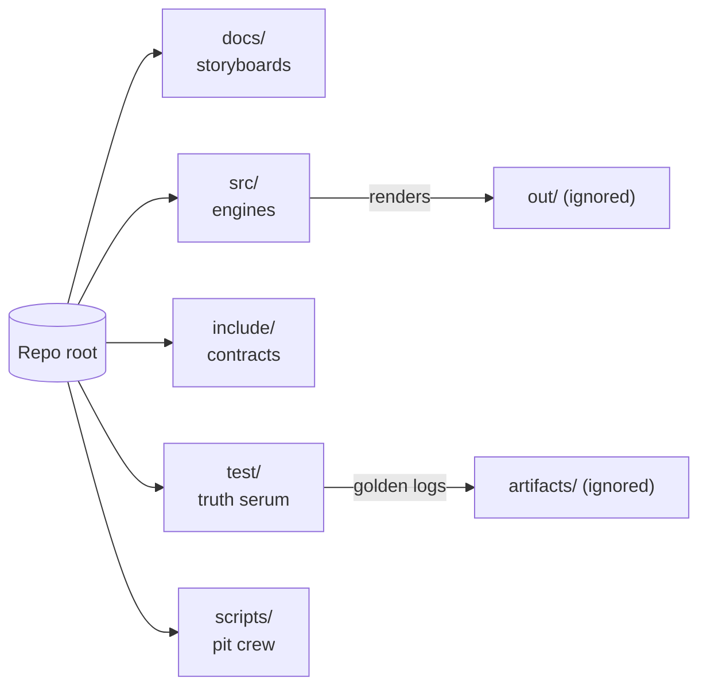
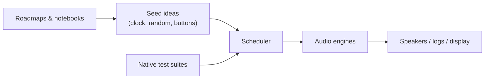
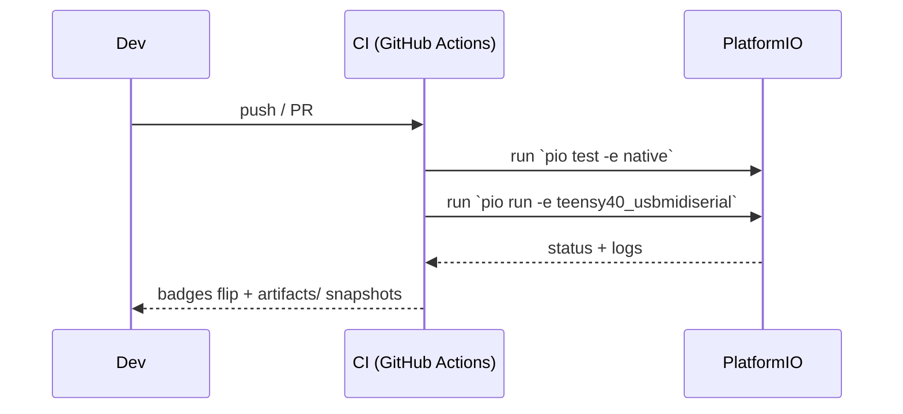

# SeedBox — playground for seeds, sound, and experiments

| Status board | Signal |
| --- | --- |
| CI (native + Teensy) | [](https://github.com/YOUR-ORG/seedBox/actions/workflows/ci.yml) |

SeedBox is a tiny music lab wrapped in C++ and wild ideas. Think of it as the
companion project to the MOARkNOBS mythos: a Teensy(IMXRT1062)-based instrument that can
also run a "pretend hardware" build on your laptop. You can poke at rhythm
engines, reseed algorithms, or display sketches without needing a soldered rig.

## Why you might hang out here

- **You like sound experiments.** Sequencers, granular dreams, happy accidents —
  they all live under one roof.
- **You learn by building.** The repo doubles as a studio notebook, so every
  folder tries to teach what it's doing.
- **You want a friendly start.** No gatekeeping; just enough tooling to get the
  firmware compiled and the tests humming.

## Quick orientation



| Folder | What's going on | First doc to read |
| --- | --- | --- |
| `docs/` | Roadmaps, design notes, wiring sketches. | [Builder primer](docs/builder_bootstrap.md) |
| `src/` | The actual instrument brain. | [Source tour](src/README.md) |
| `include/` | Header contracts the rest of the world relies on. | [Interface notes](include/README.md) |
| `test/` | Native tests that keep the grooves deterministic. | [Test guide](test/README.md) + [golden recipe](test/README.md#toggle-able-test-flags) |
| `scripts/` | Helper tools (version stamping, etc.). | [Script cheat sheet](scripts/README.md) |
| `examples/` | Runnable lesson sketches for when you want noise with narration. | [Sprout lab notes](examples/01_sprout/README.md) |

Head straight to [`docs/roadmaps/`](docs/roadmaps) for narrative design notes or
into [`test/test_engine/`](test/test_engine) for executable examples that double
as tutorials.

## Pick your adventure

- **Just want to hear something?** Plug in a Teensy 4.0, follow the wiring in
  `docs/` (the map now leans fully into 1/8" Type-A MIDI jacks riding beside
  USB), then build the `teensy40` target in PlatformIO (the older
  `teensy40_usbmidiserial` alias still works if your muscle memory insists).
- **No hardware handy?** Run the `native` environment. It uses the same logic as
  the hardware build and spits out logs/tests so you can tweak algorithms on the
  couch.
- **Documentary mode?** Read the roadmaps in `docs/` and drop ideas directly in
  Markdown. We treat documentation as part of the jam session.
- **Example safari?** The tests inside [`test/test_app`](test/test_app) and
  [`test/test_patterns`](test/test_patterns) are intentionally verbose. Read
  them like workshop demos, then riff with your own cases.

## Friendly setup checklist

These steps look long, but they're just the usual PlatformIO tune‑up written
like a zine.

1. Install PlatformIO once: `pip install -U platformio`
2. Clone this repo and step inside: `cd seedBox`
3. Grab project dependencies: `pio pkg install`
4. Run the fast tests (no hardware required): `pio test -e native`
5. When you're ready for the real synth, build the Teensy target:
   `pio run -e teensy40` *(or `-e teensy40_usbmidiserial` if you're running an
   old script — we kept the alias on purpose).* 

## Quiet mode (default sandbox state)

SeedBox now boots with `QUIET_MODE=1`. That means:

- Seeds stay unprimed until you explicitly compile with quiet mode off.
- Storage backends (`StoreEeprom`, `StoreSd`) refuse to write, keeping
  classrooms safe from surprise EEPROM/SD scribbles. They still answer `list`
  and `load` so lessons can browse presets even while the write protect light is
  flashing.
- Hardware IO (USB/TRS MIDI, seed persistence) is stubbed so the rig wakes up
  silent.

Want the full-noise experience? Flip the flag by overriding the PlatformIO env:

```ini
[env:teensy40_usbmidiserial]
build_flags =
  ${env.build_flags}
  -D SEEDBOX_HW=1
  -D USB_MIDI
  -D QUIET_MODE=0
```

Or, for a one-off build, tack on `--project-option "build_flags += -D QUIET_MODE=0"`
to your `pio run` invocation. The SparkFun Qwiic OLED will remind you it's snoozing until you
do.

## Presets, Stores, and the "don't fry the workshop" policy

SeedBox finally ships with a storage contract that mirrors the rest of the
teaching vibe:

- **`include/io/Store.h` is the promise.** It's a tiny interface (`list`,
  `load`, `save`) so lesson plans can swap between a null store, EEPROM, or SD
  without rewiring UI code. Native builds default to an in-memory EEPROM image
  so tests stay deterministic.
- **`StoreEeprom` & `StoreSd` follow the quiet-mode gospel.** Reads are always
  allowed, but writes short-circuit while `QUIET_MODE=1`. No more classroom rigs
  unexpectedly overwriting students' presets.
- **Preset snapshots live in `app/Preset.*`.** We serialize the whole scene —
  clock settings, routing, seed genomes, even the current page — to a lean JSON
  blob that all stores understand.
- **Front panel flow:** long-press the Alt button to drop into the storage page.
  Once the OLED flashes the GPIO hint, a short press on the reseed button
  recalls the active slot and a long press saves it. Crossfades happen over ~1
  second so switching scenes never rips the mix apart mid-demo.

Treat the docs like a zine: the new
[`docs/roadmaps/storage.md`](docs/roadmaps/storage.md) entry riffs on future
ideas (multi-slot banks, SD librarians, etc.) while this README keeps the how-to
front and center.

## Front panel hardware map (aka "what do my fingers actually do?")

The rig only gives you a handful of controls, but each one moonlights as a
modifier, transport hook, or classroom trick. Here's the cheat sheet so you can
teach a workshop without guessing.

| Control | Primary gestures | What it drives |
| --- | --- | --- |
| **Seed Bank encoder**<br>rotary + push | - Press from HOME/SWING to hop straight into the SEEDS page.<br>- Turn to move the focused seed (or hold **Shift** while in HOME to change focus without leaving the landing pad).<br>- Long-press the switch to queue up a fresh reseed spin. | Seed focus, reseed trigger, and the swing editor's coarse (±5%) tweak lane. |
| **Density encoder**<br>rotary + push | - Press to slide into ENGINE view.<br>- Hold **Shift** and turn while in ENGINE to cycle the focused seed's engine assignment.<br>- Turn inside the Swing pop-over for fine (±1%) groove edits. | Engine assignments and detailed swing percentages. |
| **Tone/Tilt encoder**<br>rotary + push | - Press to jump into PERF mode.<br>- Hold **Shift** for per-detent pitch nudges on the focused seed, hold **Alt** for density tweaks, or hold both to stack the edit. | Micro edits on the Seeds page and the express lane into performance view. |
| **FX/Mutate encoder**<br>rotary + push | - Press to land in UTIL.<br>- Hold **Alt** and turn to march through the quantize-scale map.<br>- Turn in UTIL to flip debug meters on/off. | Scale quantize selection, debug overlays, and utility page access. |
| **Tap Tempo button** | - Single press toggles the active clock source (and latches transport when you're already in PERF).<br>- Long press opens the Swing editor; tap again inside to exit.<br>- Double press is the express ticket into/out of SETTINGS.<br>- Hold **Alt** (and optionally **Shift** for reverse) while tapping to cycle seed prime modes. | Clock delegation, swing pop-over, settings shuttle, and seed-prime roulette. |
| **Shift button** | - Long press from anywhere to bail back to HOME.<br>- Acts as a modifier with the Seed encoder (focus shuffle), Tone/Tilt (pitch nudges), Density (engine cycling), and the Alt chord (Settings ↔︎ Perf shortcut). | Global escape hatch + performance modifiers. |
| **Alt / Storage button** | - Long press drops you into the Storage page and resets the preset-save state.<br>- Modifier with Tone/Tilt for density edits and with FX/Mutate for quantize selection.<br>- Chord with **Shift** to flip between SETTINGS and PERF mid-demo. | Storage workflows, secondary modifiers, and quick mode shuttles. |
| **Reseed button**<br>(direct-wired) | - Tap queues a reseed unless you're already on the Storage page.<br>- On the Storage page: short release recalls the highlighted slot; long hold writes it. | Master reseed trigger and hands-on preset recall/save. |
| **Lock button**<br>(direct-wired) | - Short press toggles the focused seed's lock.<br>- Long press (≈0.6 s) toggles the global lock and keeps the class from nuking their favorite genomes. | Seed locking for both per-slot and all-in freezes. |

## MIDI routing cheat sheet (hardware heads-up)

- **Two backends, one facade.** `MidiRouter` now spins up both USB and TRS-A
  backends (plus a CLI twin for tests) and publishes what each port can do. Peek
  at [`docs/interop_mn42.md`](docs/interop_mn42.md) for the routing matrix and
  handshake lore.
- **Per-page routes.** PERF mode mirrors clock + transport out of both ports so
  MN42 rigs stay in sync, while EDIT/HACK pages default to CC-only to keep lab
  experiments tame.
- **Channel map defaults.** TRS traffic gets funneled onto MN42's home channel
  by default; tweak `MidiRouter::ChannelMap` if your controller wants something
  wilder.
- **Panic button for free.** Call `MidiRouter::panic()` when a synth wedges —
  it sprays All Notes Off only on channels that are actually stuck, thanks to a
  tiny note guard.

## High-level flow (aka how seeds become sound)



This is intentionally simple. Each box has its own README if you want the
geekier signal-flow diagrams later.

### How CI babysits the jams



The CI workflow mirrors what you do locally so surprises stay onstage, not
mid-gig.

### Build flags cheat sheet

`include/SeedBoxConfig.h` is the canonical set list. The table below riffs on the
same switches so you know when to flip them mid-session.

| Flag | Where it matters | What it does |
| --- | --- | --- |
| `SEEDBOX_HW` | `src/`, `include/` | Enables Teensy-only IO paths so the firmware talks to real hardware. Leave it off for `native`. |
| `SEEDBOX_SIM` | Desktop builds, tests | Marks the host build so hardware glue stays stubbed. Pair it with `QUIET_MODE` when running labs without a Teensy. |
| `QUIET_MODE` | `src/util/`, tests | Silences verbose logging when you want clean terminal output or audio renders in `out/`. |
| `ENABLE_GOLDEN` | tests | Writes comparison data to `artifacts/` so regressions show up as diffable golden files. |
| `SEEDBOX_DEBUG_CLOCK_SOURCE` | `src/app/AppState.cpp`, clock docs | Dumps transport decisions over Serial so you can teach clock hand-offs in real time. |
| `SEEDBOX_DEBUG_UI` | UI experiments (future) | Reserved hook for UI overlays + teaching aids. Wire prototypes here before hard-coding prints elsewhere. |

Want the canonical defaults without spelunking? Run the narrator and paste the
Markdown table into whatever zine or PR needs it:

```bash
python scripts/describe_seedbox_config.py --format=markdown
```

CI runs the same helper so if the table shifts, the bots shout about it.

Any new flag deserves a note in the matching README so the teaching vibes stay
strong.

## Examples, lessons, and crosslinks

- **Docs:** Start with the [builder bootstrap](docs/builder_bootstrap.md) then
  wander through [hardware BOM](docs/hardware_bill_of_materials.md) and the
  [roadmaps](docs/roadmaps) when you want story time.
- **Source tours:** [`src/README.md`](src/README.md) threads the narrative, while
  in-file comments point to specific seed recipes.
- **Tests as tutorials:** [`test/README.md`](test/README.md) explains the suites
  and calls out how `ENABLE_GOLDEN` captures new expectations.
- **Scripts:** [`scripts/README.md`](scripts/README.md) keeps the automation
  gentle and hackable.
- **Examples as lab walks:** Crack open [`examples/`](examples) like a lab tour —
  each subfolder is a guided walkthrough tied to quiet-mode flips, reseeding
  experiments, or headless workflows, so you can feel the repo’s pulse before
  the tests and docs lock it down.

## Audio postcard (TODO)

> TODO: Capture a 30-second SeedBox groove and drop the `.wav` into `out/`. When
> it graduates to a repeatable expectation, promote the render into
> `artifacts/` alongside golden logs so the CI badge can brag about it.

## Contributing without fear

- Speak plainly in comments and docs. Pretend you're writing to your future
  self after a loud gig.
- Keep hardware-only code wrapped in the `SEEDBOX_HW` flag so the native build
  stays honest.
- Reach for `QUIET_MODE` when you want lean logs and `ENABLE_GOLDEN` when you
  need new reference data in tests.
- When you add a new idea, sketch it in Markdown or tests before wiring it into
  the firmware. The notebook is as important as the code.

### Release ritual and changelog

Before you ship something shiny, cruise through the new
[`RELEASING.md`](RELEASING.md) checklist. It walks you through version bumps,
tags, and the CI gauntlet without killing the vibe.

Curious where we log the weirdness? The
[`CHANGELOG.md`](CHANGELOG.md) keeps a running diary of hardened edges and the
audio fixtures still on deck. Read it like a zine: it's meant to teach future
you what mattered, not just what files flipped.
## Community contracts & fine print

We keep the legalese light but visible so nobody trips over it later:

- **Code & binaries:** [MIT License](LICENSE)
- **Docs, zines, and sketches:** [Creative Commons BY 4.0](LICENSE-docs)
- **How we treat each other:** [Code of Conduct](CODE_OF_CONDUCT.md)
- **How to join the build party:** [Contributing guide](CONTRIBUTING.md)
- **What to do if you find a bug with teeth:** [Security policy](SECURITY.md)

Bring your curiosity, your sense of play, and maybe some headphones.
