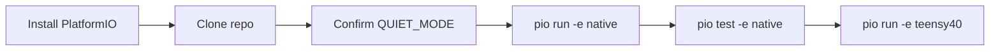
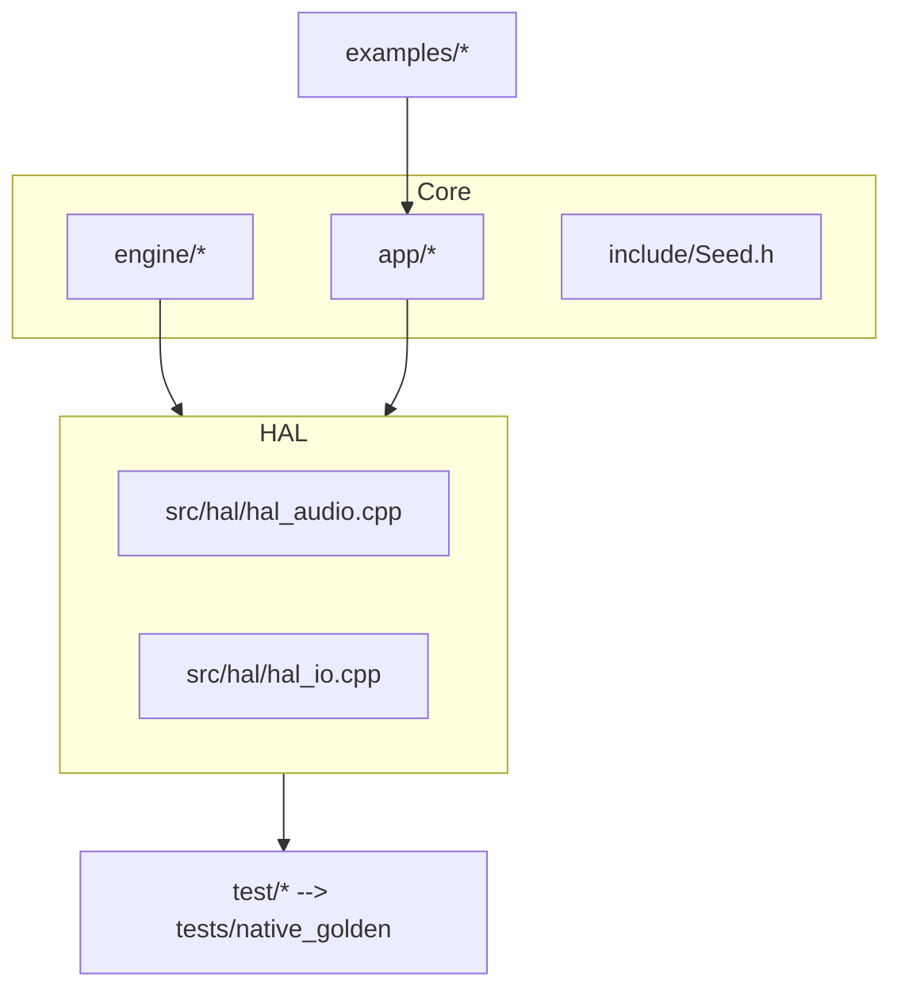
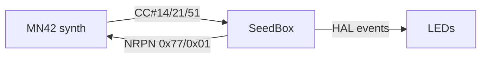
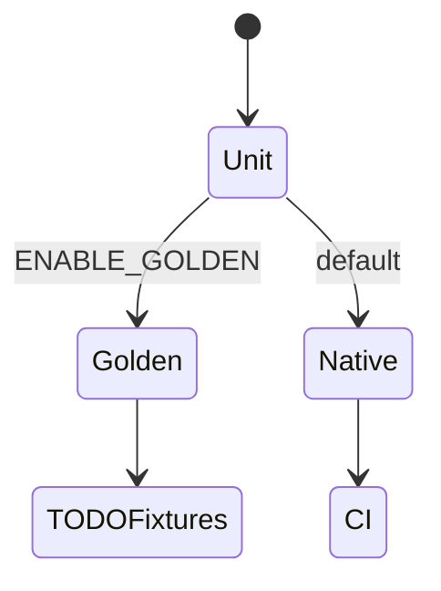
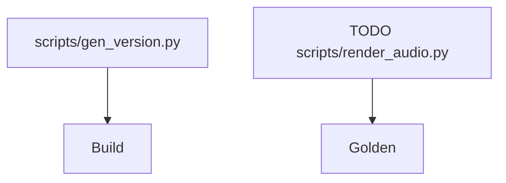

# SeedBox — tiny lab for seeds, sound, and mischief

[](https://github.com/bseverns/seedbox/actions/workflows/ci.yml)
[](LICENSE)
[](https://platformio.org/)

SeedBox is half studio notebook, half teaching guide. It runs on a Teensy 4.0 or
natively with PlatformIO, letting you test rhythm ideas on a laptop before
hauling gear to the gig.

Quiet Mode is the default: no SD writes, no secret network calls, deterministic
RNG seeded with `0x5EEDB0B1`. Flip it off by compiling with `-D QUIET_MODE=0` if
you really need persistence.

## Pick your adventure

| Mode | What you get | Jump in |
| ---- | ------------- | ------- |
| Minimal sprout | Deterministic four-seed loop, ready to mutate. | [`examples/01_sprout`](examples/01_sprout) |
| Reseed rituals | Manual reseed cadence + MN42 nudges. | [`examples/02_reseed`](examples/02_reseed) |
| Headless sim | CLI-only harness for CI and teach-ins. | [`examples/03_headless`](examples/03_headless) |

**TODO:** "Listen here" once tiny WAV fixtures land.

## Builder primer



1. `pip install -U platformio`
2. `git clone git@github.com:bseverns/seedbox.git`
3. `cd seedBox`
4. `pio run -e native && pio test -e native`
5. `pio run -e teensy40` (compile-only smoke)

See [`docs/toolchain.md`](docs/toolchain.md) for pinned versions and regeneration
commands.

## Source tour



- [`src/hal/hal_audio.h`](src/hal/hal_audio.h) details the callback seam.
- [`src/hal/hal_io.h`](src/hal/hal_io.h) keeps LEDs, buttons, and counters tame.
- [`docs/hal.md`](docs/hal.md) explains the 2.67 ms deadline and no-alloc rule.
- **TODO:** Capture oscilloscope traces showing callback headroom.

## Interface notes



- Shared constants live in [`src/interop/mn42_map.h`](src/interop/mn42_map.h).
- Handshake walkthrough: [`docs/interop_mn42.md`](docs/interop_mn42.md).
- Quiet Mode + ethics stance: [`docs/ethics.md`](docs/ethics.md).
- **TODO:** Embed screenshots of the MN42 control surface once we can capture it.

## Test guide



- Fast unit tests live under [`test/`](test/README.md).
- Golden harness stubs: [`tests/native_golden`](tests/native_golden/README.md).
- Run with `pio test -e native` (golden tests skipped unless `ENABLE_GOLDEN=1`).
- **TODO:** Generate 1–2 second WAVs and hash them into `golden.json`.

## Script cheat sheet



- Scripts live in [`scripts/`](scripts/README.md).
- `gen_version.py` stamps builds with the git revision.
- Add your own helper scripts but keep dependencies minimal.
- **TODO:** Provide a script that renders tiny WAV previews into `/out`.

## Governance + release notes

- MIT code license: [`LICENSE`](LICENSE)
- CC-BY-4.0 docs license: [`LICENSE-docs`](LICENSE-docs)
- Contributor Covenant: [`CODE_OF_CONDUCT.md`](CODE_OF_CONDUCT.md)
- Contribution guide: [`CONTRIBUTING.md`](CONTRIBUTING.md)
- Security policy: [`SECURITY.md`](SECURITY.md)
- Release process: [`RELEASING.md`](RELEASING.md)
- Change log: [`CHANGELOG.md`](CHANGELOG.md)

## Test commands (copy/paste)

```bash
pio run -e native && pio test -e native
pio run -e teensy40
```

If the proxy blocks dependency downloads, rerun after the tunnel opens. CI will
mirror these checks without uploading artifacts.

Bring your curiosity, your sense of play, and maybe some headphones.
