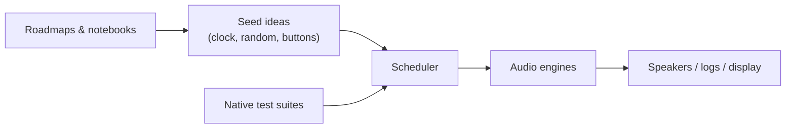

# SeedBox — playground for seeds, sound, and experiments

SeedBox is a tiny music lab wrapped in C++ and wild ideas. Think of it as the
companion project to the MOARkNOBS mythos: a Teensy 4.0 instrument that can also
run a "pretend hardware" build on your laptop. You can poke at rhythm engines,
reseed algorithms, or display sketches without needing a soldered rig.

## Why you might hang out here

- **You like sound experiments.** Sequencers, granular dreams, happy accidents —
  they all live under one roof.
- **You learn by building.** The repo doubles as a studio notebook, so every
  folder tries to teach what it's doing.
- **You want a friendly start.** No gatekeeping; just enough tooling to get the
  firmware compiled and the tests humming.

## Orientation

- Code lives in `src/`, public headers in `include/`, docs in `docs/`, and tests
  in `test/` plus the new `tests/native_golden` harness.
- Builds run through PlatformIO: `pio run -e native` for the simulator,
  `pio run -e teensy40` for hardware.
- Quiet mode keeps things deterministic. It defaults to **on** in native builds
  and examples, and off on real hardware.

## Pick your adventure

| Goal | Shortcut | Notes |
| ---- | -------- | ----- |
| Hear the default seeds in text form | [Example 01 — sprout](examples/01_sprout/README.md) | Prints the seed table. TODO: listen here once `sprout.wav` lands. |
| Watch a deterministic reseed | [Example 02 — reseed ritual](examples/02_reseed/README.md) | Shows before/after parameters. TODO: listen here once `reseed.wav` lands. |
| Run headless in CI or scripts | [Example 03 — headless loop](examples/03_headless/README.md) | Captures display snapshots. TODO: listen here once `headless.wav` lands. |

All three examples honour `QUIET_MODE=1` by default. Pass `-D QUIET_MODE=0` if
you're ready to interact with real IO.

## Flags to know

| Flag | Default | Meaning |
| ---- | ------- | ------- |
| `SEEDBOX_HW` | 0 on native, 1 on Teensy | Guards hardware-only code paths. |
| `QUIET_MODE` | 1 on native/examples, 0 on Teensy | Disables persistence + external IO, fixes RNG seeds. |
| `ENABLE_GOLDEN` | 0 | Turns on future golden-audio assertions (currently stubbed). |

## Docs with vibes

Each folder doubles as a zine. Dive in when you want the deeper story:

| Doc | What you'll learn |
| --- | ----------------- |
| [Builder primer](docs/builder_bootstrap.md) | Tooling rituals, wiring, TODO listen-here markers. |
| [Source tour](src/README.md) | How code flows and how to extend it without stress. |
| [Interface notes](include/README.md) | Header promises + interop tips. |
| [Test guide](test/README.md) | Unity layout, golden harness status, TODO audio hashes. |
| [Script cheat sheet](scripts/README.md) | Tiny helpers like `gen_version.py`. |
| [Toolchain pins](docs/toolchain.md) | Exact PlatformIO versions and regeneration steps. |
| [HAL seam](docs/hal.md) | Timing deadlines, no-alloc rules, mocking advice. |
| [MN42 interop](docs/interop_mn42.md) | MIDI CC map for the sister controller. |
| [Assumptions](docs/assumptions.md) & [Ethics](docs/ethics.md) | Cultural guardrails. |

## Tests & CI

- Native smoke: `pio run -e native && pio test -e native`
- Teensy smoke: `pio run -e teensy40`
- Golden harness: lives in `tests/native_golden/` with stubbed WAV writers (see
  the README there for TODOs).
- GitHub Actions runs both environments without uploading artifacts.

## Release notes & governance

- Check [CHANGELOG.md](CHANGELOG.md) for tagged releases (`v0.1.0` captures this
  hardening pass).
- [CONTRIBUTING.md](CONTRIBUTING.md) and [CODE_OF_CONDUCT.md](CODE_OF_CONDUCT.md)
  set expectations.
- Security questions? Read [SECURITY.md](SECURITY.md) and email
  `seedbox-security@bseverns.dev`.

## Road to golden audio

We're deliberately leaving audio fixtures out of git. Future passes will:

- Render 16-bit PCM WAVs for sprout/reseed/headless demos.
- Hash them into `tests/native_golden/golden.json`.
- Publish "listen here" links once storage is set up.

Until then, enjoy the notebook vibe, keep things deterministic, and add TODO
markers wherever audio should eventually live.
