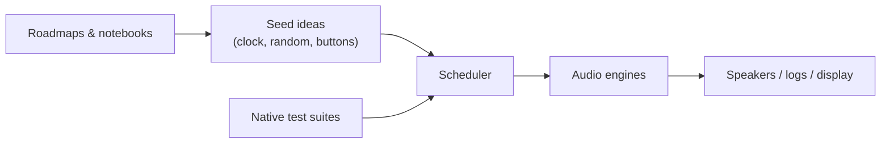

# SeedBox — playground for seeds, sound, and experiments

SeedBox is a tiny music lab wrapped in C++ and wild ideas. Think of it as the
companion project to the MOARkNOBS mythos: a Teensy 4.0 instrument that can
also run a "pretend hardware" build on your laptop. You can poke at rhythm
engines, reseed algorithms, or display sketches without needing a soldered rig.

## Why you might hang out here

- **You like sound experiments.** Sequencers, granular dreams, happy accidents —
  they all live under one roof.
- **You learn by building.** The repo doubles as a studio notebook, so every
  folder tries to teach what it's doing.
- **You want a friendly start.** No gatekeeping; just enough tooling to get the
  firmware compiled and the tests humming.

## Quick orientation

| Folder | What's going on | First doc to read |
| --- | --- | --- |
| `docs/` | Roadmaps, design notes, wiring sketches. | [Builder primer](docs/builder_bootstrap.md) |
| `src/` | The actual instrument brain. | [Source tour](src/README.md) |
| `include/` | Header contracts the rest of the world relies on. | [Interface notes](include/README.md) |
| `test/` | Native tests that keep the grooves deterministic. | [Test guide](test/README.md) |
| `scripts/` | Helper tools (version stamping, etc.). | [Script cheat sheet](scripts/README.md) |

## Pick your adventure

- **Just want to hear something?** Plug in a Teensy 4.0, follow the wiring in
  `docs/`, then build the `teensy40_usbmidiserial` target in PlatformIO.
- **No hardware handy?** Run the `native` environment. It uses the same logic as
  the hardware build and spits out logs/tests so you can tweak algorithms on the
  couch.
- **Documentary mode?** Read the roadmaps in `docs/` and drop ideas directly in
  Markdown. We treat documentation as part of the jam session.
- **Wiring SeedBox to an MN42?** Start with the
  [interop cheat sheet](docs/interop_mn42.md) so your CC handshakes stay in tune.

## Friendly setup checklist

These steps look long, but they're just the usual PlatformIO tune‑up written
like a zine.

1. Install PlatformIO once: `pip install -U platformio`
2. Clone this repo and step inside: `cd seedBox`
3. Grab project dependencies: `pio pkg install`
4. Run the fast tests (no hardware required): `pio test -e native`
5. When you're ready for the real synth, build the Teensy target:
   `pio run -e teensy40_usbmidiserial`

## High-level flow (aka how seeds become sound)

This is intentionally simple. Each box has its own README if you want the
geekier signal-flow diagrams later.

## Contributing without fear

- Speak plainly in comments and docs. Pretend you're writing to your future
  self after a loud gig.
- Keep hardware-only code wrapped in the `SEEDBOX_HW` flag so the native build
  stays honest.
- When you add a new idea, sketch it in Markdown or tests before wiring it into
  the firmware. The notebook is as important as the code.

Bring your curiosity, your sense of play, and maybe some headphones.
