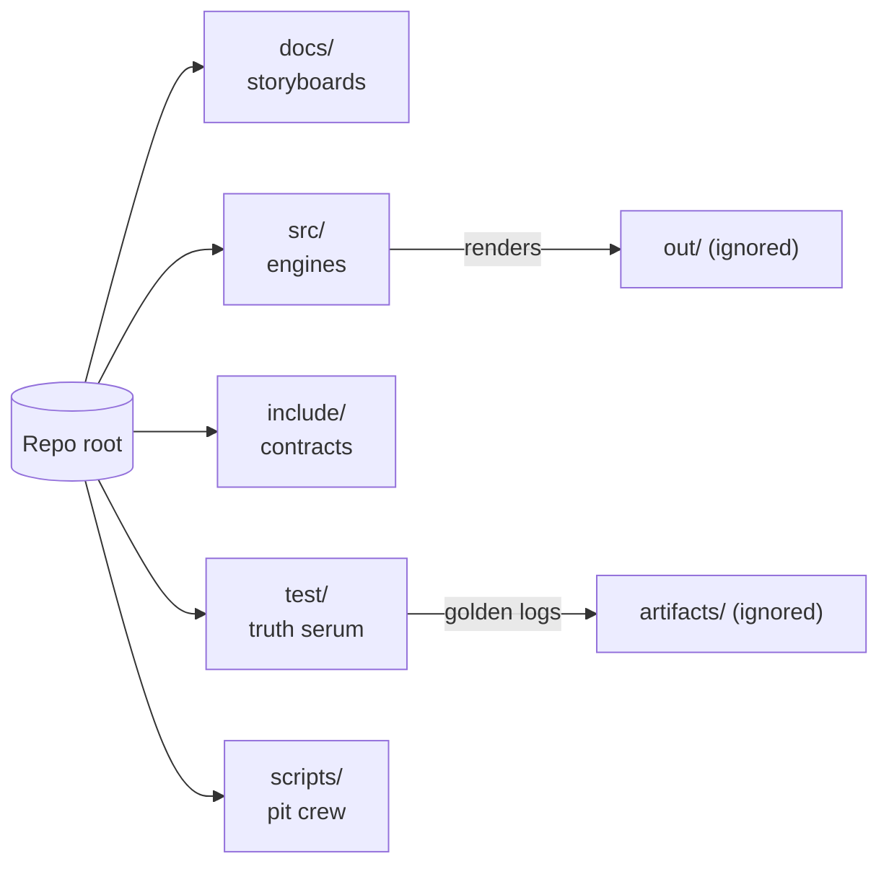
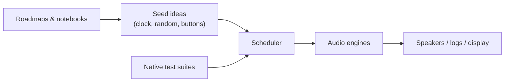
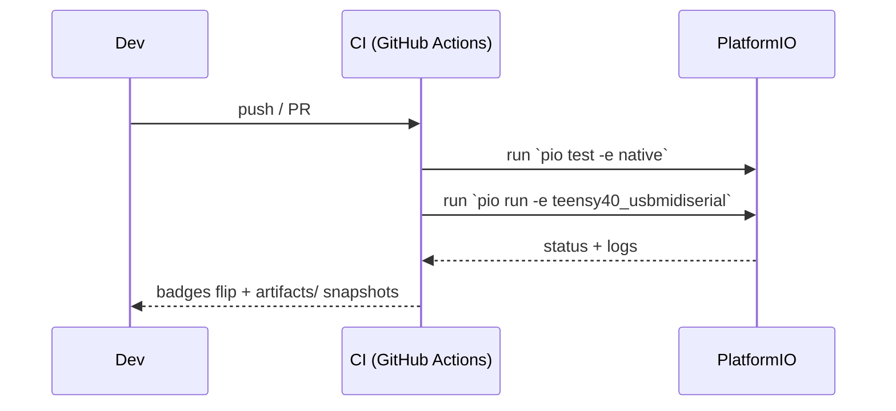

# SeedBox — playground for seeds, sound, and experiments

| Status board | Signal |
| --- | --- |
| CI (native + Teensy) | [](https://github.com/YOUR-ORG/seedBox/actions/workflows/ci.yml) |

> Tip: swap `YOUR-ORG` with your GitHub handle so the badge points at the right stage lights.

SeedBox is a tiny music lab wrapped in C++ and wild ideas. Think of it as the
companion project to the MOARkNOBS mythos: a Teensy 4.0 instrument that can
also run a "pretend hardware" build on your laptop. You can poke at rhythm
engines, reseed algorithms, or display sketches without needing a soldered rig.

## Why you might hang out here

- **You like sound experiments.** Sequencers, granular dreams, happy accidents —
  they all live under one roof.
- **You learn by building.** The repo doubles as a studio notebook, so every
  folder tries to teach what it's doing.
- **You want a friendly start.** No gatekeeping; just enough tooling to get the
  firmware compiled and the tests humming.

## Quick orientation



| Folder | What's going on | First doc to read |
| --- | --- | --- |
| `docs/` | Roadmaps, design notes, wiring sketches. | [Builder primer](docs/builder_bootstrap.md) |
| `src/` | The actual instrument brain. | [Source tour](src/README.md) |
| `include/` | Header contracts the rest of the world relies on. | [Interface notes](include/README.md) |
| `test/` | Native tests that keep the grooves deterministic. | [Test guide](test/README.md) + [golden recipe](test/README.md#toggle-able-test-flags) |
| `scripts/` | Helper tools (version stamping, etc.). | [Script cheat sheet](scripts/README.md) |
| `examples/` | Runnable lesson sketches for when you want noise with narration. | [Sprout lab notes](examples/01_sprout/README.md) |

Head straight to [`docs/roadmaps/`](docs/roadmaps) for narrative design notes or
into [`test/test_engine/`](test/test_engine) for executable examples that double
as tutorials.

## Pick your adventure

- **Just want to hear something?** Plug in a Teensy 4.0, follow the wiring in
  `docs/` (the map now leans fully into 1/8" Type-A MIDI jacks riding beside
  USB), then build the `teensy40` target in PlatformIO (the older
  `teensy40_usbmidiserial` alias still works if your muscle memory insists).
- **No hardware handy?** Run the `native` environment. It uses the same logic as
  the hardware build and spits out logs/tests so you can tweak algorithms on the
  couch.
- **Documentary mode?** Read the roadmaps in `docs/` and drop ideas directly in
  Markdown. We treat documentation as part of the jam session.
- **Example safari?** The tests inside [`test/test_app`](test/test_app) and
  [`test/test_patterns`](test/test_patterns) are intentionally verbose. Read
  them like workshop demos, then riff with your own cases.

## Friendly setup checklist

These steps look long, but they're just the usual PlatformIO tune‑up written
like a zine.

1. Install PlatformIO once: `pip install -U platformio`
2. Clone this repo and step inside: `cd seedBox`
3. Grab project dependencies: `pio pkg install`
4. Run the fast tests (no hardware required): `pio test -e native`
5. When you're ready for the real synth, build the Teensy target:
   `pio run -e teensy40` *(or `-e teensy40_usbmidiserial` if you're running an
   old script — we kept the alias on purpose).* 

## Quiet mode (default sandbox state)

SeedBox now boots with `QUIET_MODE=1`. That means:

- Seeds stay unprimed until you explicitly compile with quiet mode off.
- Storage helpers refuse to write, keeping classrooms safe from surprise SD
  scribbles.
- Hardware IO (USB/TRS MIDI, seed persistence) is stubbed so the rig wakes up
  silent.

Want the full-noise experience? Flip the flag by overriding the PlatformIO env:

```ini
[env:teensy40_usbmidiserial]
build_flags =
  ${env.build_flags}
  -D SEEDBOX_HW=1
  -D USB_MIDI
  -D QUIET_MODE=0
```

Or, for a one-off build, tack on `--project-option "build_flags += -D QUIET_MODE=0"`
to your `pio run` invocation. The SparkFun Qwiic OLED will remind you it's snoozing until you
do.

## MIDI routing cheat sheet (hardware heads-up)

- **Two backends, one facade.** `MidiRouter` now spins up both USB and TRS-A
  backends (plus a CLI twin for tests) and publishes what each port can do. Peek
  at [`docs/interop_mn42.md`](docs/interop_mn42.md) for the routing matrix and
  handshake lore.
- **Per-page routes.** PERF mode mirrors clock + transport out of both ports so
  MN42 rigs stay in sync, while EDIT/HACK pages default to CC-only to keep lab
  experiments tame.
- **Channel map defaults.** TRS traffic gets funneled onto MN42's home channel
  by default; tweak `MidiRouter::ChannelMap` if your controller wants something
  wilder.
- **Panic button for free.** Call `MidiRouter::panic()` when a synth wedges —
  it sprays All Notes Off only on channels that are actually stuck, thanks to a
  tiny note guard.

## High-level flow (aka how seeds become sound)



This is intentionally simple. Each box has its own README if you want the
geekier signal-flow diagrams later.

### How CI babysits the jams



The CI workflow mirrors what you do locally so surprises stay onstage, not
mid-gig.

### Build flags cheat sheet

| Flag | Where it matters | What it does |
| --- | --- | --- |
| `SEEDBOX_HW` | `src/`, `include/` | Enables Teensy-only IO paths so the firmware talks to real hardware. Leave it off for `native`. |
| `QUIET_MODE` | `src/util/`, tests | Silences verbose logging when you want clean terminal output or audio renders in `out/`. |
| `ENABLE_GOLDEN` | tests | Writes comparison data to `artifacts/` so regressions show up as diffable golden files. |

Any new flag deserves a note in the matching README so the teaching vibes stay
strong.

## Examples, lessons, and crosslinks

- **Docs:** Start with the [builder bootstrap](docs/builder_bootstrap.md) then
  wander through [hardware BOM](docs/hardware_bill_of_materials.md) and the
  [roadmaps](docs/roadmaps) when you want story time.
- **Source tours:** [`src/README.md`](src/README.md) threads the narrative, while
  in-file comments point to specific seed recipes.
- **Tests as tutorials:** [`test/README.md`](test/README.md) explains the suites
  and calls out how `ENABLE_GOLDEN` captures new expectations.
- **Scripts:** [`scripts/README.md`](scripts/README.md) keeps the automation
  gentle and hackable.
- **Examples as lab walks:** Crack open [`examples/`](examples) like a lab tour —
  each subfolder is a guided walkthrough tied to quiet-mode flips, reseeding
  experiments, or headless workflows, so you can feel the repo’s pulse before
  the tests and docs lock it down.

## Audio postcard (TODO)

> TODO: Capture a 30-second SeedBox groove and drop the `.wav` into `out/`. When
> it graduates to a repeatable expectation, promote the render into
> `artifacts/` alongside golden logs so the CI badge can brag about it.

## Contributing without fear

- Speak plainly in comments and docs. Pretend you're writing to your future
  self after a loud gig.
- Keep hardware-only code wrapped in the `SEEDBOX_HW` flag so the native build
  stays honest.
- Reach for `QUIET_MODE` when you want lean logs and `ENABLE_GOLDEN` when you
  need new reference data in tests.
- When you add a new idea, sketch it in Markdown or tests before wiring it into
  the firmware. The notebook is as important as the code.

### Release ritual and changelog

Before you ship something shiny, cruise through the new
[`RELEASING.md`](RELEASING.md) checklist. It walks you through version bumps,
tags, and the CI gauntlet without killing the vibe.

Curious where we log the weirdness? The
[`CHANGELOG.md`](CHANGELOG.md) keeps a running diary of hardened edges and the
audio fixtures still on deck. Read it like a zine: it's meant to teach future
you what mattered, not just what files flipped.
## Community contracts & fine print

We keep the legalese light but visible so nobody trips over it later:

- **Code & binaries:** [MIT License](LICENSE)
- **Docs, zines, and sketches:** [Creative Commons BY 4.0](LICENSE-docs)
- **How we treat each other:** [Code of Conduct](CODE_OF_CONDUCT.md)
- **How to join the build party:** [Contributing guide](CONTRIBUTING.md)
- **What to do if you find a bug with teeth:** [Security policy](SECURITY.md)

Bring your curiosity, your sense of play, and maybe some headphones.
