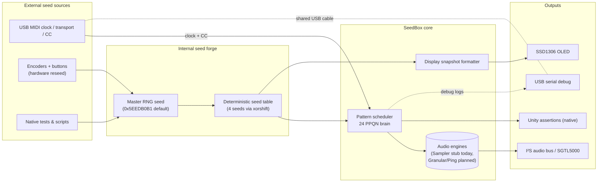

# SeedBox — PlatformIO Scaffold (Teensy 4.0 + Native Sim)

Welcome to the sonic bunker. SeedBox speaks with the same gravelly confidence
as **MOARkNOBS-42**: this project exists to pick seeds, launch voices, and make
noise on purpose. It's a ready-to-build scaffold for **Teensy 4.0** with a
**native (host) test env**. It compiles in two modes that share the same core
state machine:

- `teensy40_usbmidiserial`: real hardware with I²S audio, USB MIDI + Serial.
- `native`: host build for fast testing of schedulers, JSON, CC mapping (no Teensy libs).

## Quickstart

```bash
# 1) Install PlatformIO if needed
pip install -U platformio

# 2) Enter project
cd seedBox

# 3) Install libraries (first time)
pio pkg install

# 4) Run unit tests fast (native)
pio test -e native

# 5) Build hardware target (brings in the Teensy USB + audio stack)
pio run -e teensy40_usbmidiserial

# 6) Upload (if using teensy-cli)
pio run -e teensy40_usbmidiserial --target upload

# 7) Open serial monitor
pio device monitor -b 115200
```

## Structure

```
scripts/gen_version.py   # emits include/BuildInfo.h from git info
include/                 # public headers
src/                     # implementation: app/ engine/ io/ util/
test/                    # Unity tests (native env)
```

## Big-picture signal flow (seeds in, sound out)



## MIDI nerve center

SeedBox keeps a USB MIDI umbilical cord plugged in at all times. On the
hardware target the Teensy enumerates as `USB_MIDI_SERIAL`, so the same cable
carries note clocks **and** serial debug spew. The native build skips the USB
stack entirely (that code is `#ifdef SEEDBOX_HW`), so tests focus on the
scheduler/display logic and drive reseeds directly. On hardware the
`MidiRouter` watches the USB inbox for three critical message families:

1. **Clock / Start / Stop** – incoming transport decides when the internal
   scheduler advances ticks. We treat the external clock as gospel, so the
   router converts each `0xF8` clock pulse into a 24 PPQN tick and fans it out
   to the seed scheduler.
2. **Control Change (CC)** – raw CC data gets normalized and mapped to density,
   mutate, FX sends, or whatever macro you bind later. For now the handler is a
   stub, but the plumbing already captures channel, controller, and value.
3. **Future note / SysEx hooks** – there is room to latch note-on velocity for
   per-seed accenting or pump bulk dumps for seed banks. Those handlers stay
   empty in code today, but the README makes the intent explicit so nobody
   forgets what the ports are for.

Because the USB wire doubles as a serial console, you can print debug traces
right alongside MIDI data without re-flashing a different firmware build. That
punk-rock convenience means live rigs stay patched exactly the way your tests
expect.

## Seed lifecycle & voice doctrine

Every tick (24 PPQN) we march through the seed list and enforce this order of
operations — the comments in `PatternScheduler::onTick` document each stage so
future engine work lands in the right slot:

1. **Pick** – the scheduler decides which seed wakes up. Density gates and
   probabilities do the filtering so only the chosen ones speak.
2. **Schedule** – translate clock time + jitter into sample-accurate triggers so
   the DSP core can slam voices in on the grid (or just off it, artistically).
3. **Render** – placeholder today. `Sampler::trigger` is a stub that will
   allocate a voice once the DSP graph lands.
4. **Mutate** – also future work. The hook exists so mutate math can live next
   to the render call once those parameters matter.

## Minimal DSP attack plan

We favor fast-to-first-sound setups. Pick your poison:

### Option A — Sampler / One-Shot (first on deck)

- The C++ skeleton exists (`engine/Sampler.*`) but only stubs are wired today.
  The plan is to preload up to 16 one-shots into RAM for snappy percussion while
  longer clips stream from SD.
- Trigger handling will eventually wrap each hit with envelope + tilt-EQ + soft
  clipper before hitting the shared FX bus.

### Option B — Granular (expressive, roadmap)

- Design sketch only right now. Goal: stream source audio from SD and keep
  20–40 active grains per Teensy 4.0 for a comfy CPU margin.
- Grain size, spray, pitch, window, and stereo spread will come from the seed so
  patterns morph under deterministic control.

### Option C — Resonator / Ping (CPU-light, roadmap)

- Also future-facing. The plan is to fire short excitation bursts into a
  Karplus-Strong string or modal bank.
- Seed pitch plus density/probability would dictate excite rate for metallic
  arpeggios that run all night.

## Operator console (what you see + touch)

### Display feed — MN42-grade 0.96" SSD1306 I²C OLED

- Uses the exact module from MOARkNOBS-42: 128×64 monochrome, address `0x3C`
  on 3V3 I²C (`SCL=19`, `SDA=18`). No reset pin needed; it auto-boots when the
  Teensy powers up.
- `AppState::captureDisplaySnapshot` prepares four 16-char lines you can blast
  straight to the screen. That snapshot is live in both hardware and native
  builds so your desktop sim mirrors the real thing.
- Line breakdown (mirrors MOARkNOBS ergonomics):
  1. **Title bar** – `SeedBox <masterSeed>` so you always know which RNG epoch
     you're hearing.
  2. **Status** – focused seed number + engine tag (`SMP`, `GRA`, `PING`) and
     current pitch offset in semitones.
  3. **Metrics** – density and probability so you can read the groove at a
     glance.
  4. **Nuance** – jitter (ms) and mutate amount so you can gauge how wild the
     seed is allowed to wander.
- When no seeds are active the display shouts `no seeds loaded` and invites you
  to reseed, which makes debugging obvious during bring-up.

### Controls + pin map

| Control | Teensy pins | Role | Notes |
|---------|-------------|------|-------|
| Encoder 1 (Seed/Bank + push) | A:0, B:1, Push:2 | Scrolls focused seed / bank select | Long-press wiring should call `AppState::reseed(...)` for RNG resets. |
| Encoder 2 (Density/Prob + push) | A:3, B:4, Push:5 | Rotate to balance density vs probability; push cycles parameter focus | Matching MOARkNOBS detent direction. |
| Encoder 3 (Tone/Tilt + push) | A:6, B:7, Push:8 | Sweeps tone tilt + EQ macros | Push toggles coarse / fine. |
| Encoder 4 (FX/Mutate + push) | A:9, B:10, Push:11 | Drives master FX send + mutate amount | Push arm for latch automation. |
| Tap Tempo button | 12 | Human clock in | Short tap = tempo, hold = clock source select. |
| Shift button | 13 | Modifier chord | Use for alternate encoder layers. |
| Alt Seed trigger | 14 | Instant seed swap | Handy for A/B testing. |
| Expression input 1 | 15 (analog) | CV in 0–3.3 V | Map to any macro via CC learn. |
| Expression input 2 | 16 (analog) | CV in 0–3.3 V | Pairs nicely with mutate depth. |

All pin assignments live in `include/HardwareConfig.h` so firmware and CAD stay
in lockstep. Adjust once there and the rest of the code picks it up.

## Seed boot + reseed rituals

- Boot (hardware or sim) calls `AppState::primeSeeds(...)` under the hood via
  `initHardware` / `initSim`. Four seeds spawn immediately from the master RNG
  seed (`0x5EEDB0B1` by default) and feed the scheduler before the first tick.
- The snapshot + scheduler always reference the currently focused seed. Call
  `AppState::setFocusSeed(index)` when an encoder movement changes focus so the
  display tracks the performer.
- To reseed on **hardware**, wire your long-press handler (typically Encoder 1
  push) to `app.reseed(newSeedValue)`. If you pass `0` the app falls back to
  the default master seed, otherwise it uses whatever 32-bit epoch you provide.
- To reseed in the **native sim**, poke the global `app` object from your test
  harness or REPL:

  ```cpp
  app.reseed(0xDEADBEEF);
  app.setFocusSeed(2);
  AppState::DisplaySnapshot snap;
  app.captureDisplaySnapshot(snap);
  ```

  That routine mirrors what the hardware UI will render, so you can script
  regression tests that assert against the display without touching a screen.

- Every reseed regenerates the same deterministic seed table on both targets
  thanks to the shared xorshift RNG, so snapshots, scheduler hits, and future
  audio all stay in sync.

## Notes

- Hardware audio is stubbed behind `SEEDBOX_HW`; native builds use a monotonic
  sample counter so schedulers behave.
- PlatformIO `build_src_filter` keeps hardware-only pieces out of native builds
  so tests stay fast.
- Granular and resonator engines will plug into the same seed doctrine, so
  extending the box should stay deterministic.
