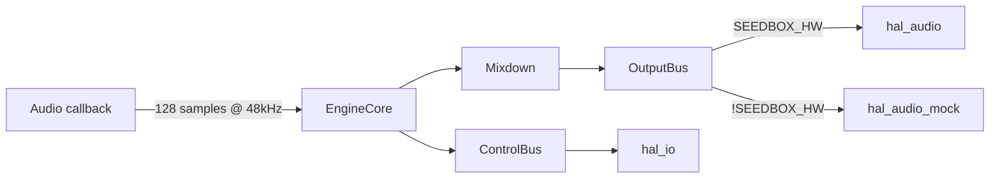

# Hardware Abstraction Layer (HAL)

SeedBox splits hardware concerns into seams so the same musical logic can run on
Teensy hardware or the native simulator. The HAL is intentionally tiny:

## Timing budget

- Teensy audio engine pushes 128-sample buffers at 48 kHz.
- That gives us roughly **2.67 ms** per callback (128 / 48000).
- Leave at least 25% headroom for interrupt jitter and sensor reads.

## Rules of the road

- **No dynamic allocation in the audio callback.** Pre-size pools and reuse
  buffers. Document any heap usage in setup code.
- Keep HAL calls deterministic. Avoid branching on external IO where possible.
- Route long-running tasks (logging, file IO, analytics) through non-audio
  threads or deferred jobs.

## Files

- `src/hal/hal_audio.h/.cpp` — audio device seam (Teensy vs. native mock).
- `src/hal/hal_io.h/.cpp` — lightweight IO hooks (LEDs, inputs, sensors).

When `SEEDBOX_HW` is defined the Teensy implementations compile in; otherwise
native mocks provide stubbed timing and logging.

## Mocking in tests

- Include `src/hal/hal_audio.h` and `src/hal/hal_io.h` from native tests.
- Provide fake implementations via dependency injection or compile-time hooks.
- The native HAL exposes simple setter/getter pairs so tests can advance time and
  capture events without hitting hardware.

## Related flags

- `SEEDBOX_HW` — hardware build (Teensy 4.0).
- `SEEDBOX_SIM` — native build with mocked HAL.
- `QUIET_MODE` — disables persistence, networking, and random seeds unless
  explicitly overridden.
- `ENABLE_GOLDEN` — unlocks deterministic audio fixture checks (off by default).

Write notes in [`docs/assumptions.md`](assumptions.md) whenever you steal from
this timing budget. Future you will thank you.
