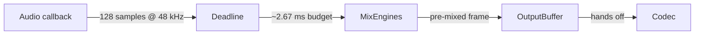

# HAL seam tour — audio + IO contracts

SeedBox rides on a thin hardware abstraction layer so the same code can groove
on a Teensy 4.0 or your laptop. This doc sketches the edges and the promises
so tests stay believable.

## Timing at a glance

- **Buffer size**: 128 samples.
- **Sample rate**: 48 kHz.
- **Deadline**: ~2.67 ms per callback. Miss it and the SGTL5000 under-runs.

Keep the callback lean: pre-allocate everything, prefer stack structs, and leave
fancy allocation for setup code.

## Files of interest

| File | Purpose |
| ---- | ------- |
| `src/hal/hal_audio.h/.cpp` | Boots audio backends and exposes timing facts. |
| `src/hal/hal_io.h/.cpp` | Centralizes MIDI/IO polling so the main loop stays tidy. |

Both modules use `SEEDBOX_HW` to choose the implementation. Native builds stub
everything so tests can fake hardware without linking to Teensy libs.

## Quiet mode contract

`QUIET_MODE` defaults to `1` in examples and the native environment. When true:

- Hardware setup skips external IO (no MIDI flood, no SD persistence).
- Random seeds stay fixed so golden-audio captures line up.
- Tests can simulate hardware by toggling flags rather than swapping binaries.

Disable it by defining `-D QUIET_MODE=0` in your build flags or by adding the
macro at the top of an example. Document every time you flip it.

## Mocking the HAL

- Include `hal/hal_audio.h` and `hal/hal_io.h` in native tests.
- Provide alternative implementations in your test translation unit if you need
  to assert on callback counts. The headers only expose free functions, so you
  can drop replacement definitions into the test file under `#ifndef SEEDBOX_HW`.
- Use the `ENABLE_GOLDEN` flag when you're ready to render deterministic audio
  buffers to disk (TODO: wire up WAV dumps once fixtures land).

Remember: **no allocation in audio callbacks**. If a test needs custom buffers,
create them statically in the harness and hand pointers through the HAL.
