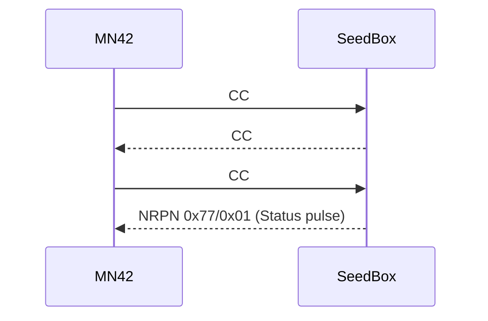

# SeedBox ↔ MN42 handshake

MN42 is the neighboring synth in the MOARkNOBS universe. We share a simple
control map so the two boxes can swap moods without MIDI spaghetti.



## Control map (`mn42_map.h`)

| Symbol | Value | Meaning |
| ------ | ----- | ------- |
| `kCcReseed` | 14 | Trigger a deterministic reseed in Quiet Mode. |
| `kCcDensityNudge` | 21 | Offset density (+/- around 64). |
| `kCcEngineCycle` | 51 | Cycle the focused SeedBox engine. |
| `kSysExHandshake` | `0x77 0x01` | Minimal SysEx/NRPN handshake payload. |

## Basic handshake

1. MN42 sends CC#14 with value 64 to request a reseed.
2. SeedBox reseeds (if `QUIET_MODE` is enabled) and replies with CC#51 carrying
the active engine index.
3. Optional: SeedBox sends an NRPN using `kSysExHandshake` so MN42 can latch the
current macro bank.

## Example payloads

- **MN42 → SeedBox reseed:** `B0 0E 40`
- **SeedBox → MN42 engine confirm:** `B0 33 02`
- **SeedBox → MN42 NRPN pulse:** `B0 63 77  B0 62 01  B0 06 01`

## Testing without hardware

Use the native build with the HAL mocks:

```bash
pio run -e native
pio test -e native --filter native_golden
```

Then inject CC events via the test harness or future golden-audio fixtures.

## TODO

- TODO: Capture a short audio clip showing MN42 driving SeedBox reseed cadence.
- TODO: Publish integration tests once golden fixtures exist.
