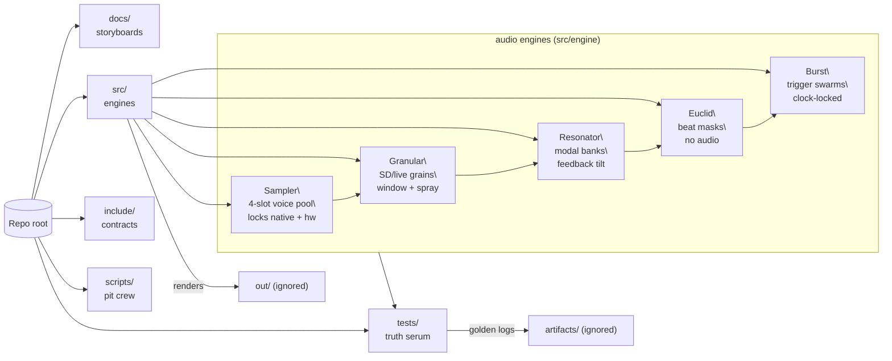

# SeedBox Orientation Zine

## Why this project exists
SeedBox is built so you can audition synth ideas anywhere: it ships as firmware for a Teensy 4.0 brain **and** as a native simulator. That dual life keeps experiments fast—prototype riffs on your laptop, then flash the exact same seed DNA onto hardware when it’s ready for stage lights.

## Core concepts to latch onto early
- **Seeds as genomes:** Every voice is driven by a `Seed` struct. Reseeding is swapping genomes, not patch cables, so deterministic playback and UI snapshots both spin from the same data.
- **AppState heartbeat:** `AppState::tick()` is the global conductor—polls IO, routes gestures, advances the scheduler, and refreshes UI snapshots so hardware and simulator never drift.
- **HAL mirrors:** `hal_audio` and `hal_io` present identical faces to Teensy and the native mock. Tests stay deterministic because both worlds speak the same contract.

## Repo topology tour
| Path | What lives here | Why you should care |
|------|-----------------|---------------------|
| `src/app/` | `AppState`, gesture routing, clock + scheduler glue | Start here to grok how button mashes become seed triggers |
| `src/engine/` | Granular, resonator, sampler, Euclid/Burst DSP cores | Pick one engine and follow it end-to-end to learn the seed → sound path |
| `src/ui/` | Text frame composition and OLED mirroring | UI snapshots keep hardware and ASCII views in lockstep—handy for debugging |
| `src/io/` | MIDI + storage plumbing | Understand how external clocks and preset persistence hook in |
| `include/` | Public headers (`Seed`, hardware config, build flags) | Your reference sheet for the cross-platform contracts |
| `tests/` | Mirrors runtime: UI walkthroughs, engine determinism, pattern math | Run `pio test -e native` every time you tweak logic; the scripts read like tutorials |
| `docs/` | Setup guides, ethics, wiring, tutorials | Living notebook—extend it when you learn something new |
| `scripts/` | Tooling for golden fixtures, KiCad, native helpers | Use these instead of hand-rolling one-off CLI scripts |
| `examples/` | Runnable lessons for automation, quiet-mode grooves, quantizer labs | Fastest way to see seeds in action without flashing hardware |

### Map at a glance

### Folder cheat sheet

The first docs to read from each folder:

| Folder | First doc to read |
| --- | --- |
| `docs/` | [Builder primer](../builder_bootstrap.md) |
| `src/` | [Source tour](../../src/README.md) |
| `include/` | [Interface notes](../../include/README.md) |
| `tests/` | [Test guide](../../tests/README.md) + [golden recipe](../../tests/README.md#toggle-able-test-flags) |
| `scripts/` | [Script cheat sheet](../../scripts/README.md) |
| `examples/` | [Sprout lab notes](../../examples/01_sprout/README.md) |

## Habit-forming workflows
1. **Trace a gesture in tests:** Open `tests/test_app/test_scripted_front_panel_walkthrough.cpp` alongside `src/app/AppState.cpp`. Watch each `InputEvent` morph into reseeds, locks, and page hops.
2. **Render golden audio often:** `pio test -e native_golden` regenerates fixtures so reviewers diff actual sound, not guesses.
3. **Prototype headless:** `examples/03_headless` lets you automate reseed rituals from the CLI—perfect for regression scripts or algorithm prototyping.

## Expand these next
- **Hands-on tutorials:** We have stellar docs for live input primes and scale quantizing. Add guides for Euclid/Burst pattern labs or HAL poking sessions.
- **UI snapshot gallery:** Capture `AsciiOledView` outputs for key states (clock external, swing edit, reseed lock) so workshops have ready-made visuals.
- **Script walk-throughs:** Mirror example READMEs for `scripts/native/*` and `scripts/kicad/*` so power tools aren’t hidden behind guesswork.

## Compost candidates (trim without mercy)
- **Empty troubleshooting tables:** `docs/troubleshooting_log.md` ships blank—either start logging real incidents or compost the scaffolding.
- **Bloated fixtures:** `build/fixtures/` tracks goldens, but files like `long-random-take.wav` make reviews a slog. Archive rarely used captures and refresh `golden.json` when you prune.
- **Retired warnings:** The top-level README still mentions the dead `teensy40_usbmidiserial` alias. Once you confirm no downstream docs depend on it, kill the warning to keep the intro punchy.

## Where to explore after onboarding
- Dive into one DSP engine + matching tests to master the seed pipeline.
- Follow a tutorial (`docs/tutorials/live_input_prime_mode.md`, `docs/tutorials/scale_quantizer_flow.md`) with the matching example so the UI stories stick.
- Sketch new reseed rituals in `tests/test_app/`—tests double as documentation in this repo.

Welcome to the lab. Keep it loud, keep it intentional, and narrate every new trick you learn so the next traveler gets there faster.
