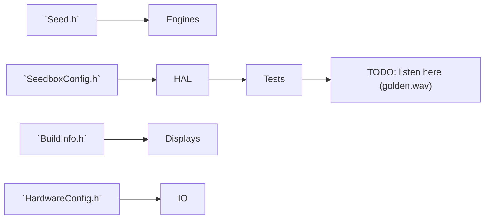

# Public headers — promises in plain language

Everything in `include/` is a handshake between different parts of SeedBox (and
any curious side projects). Treat these headers like a reference zine: skim a
file to understand the vocabulary before diving into implementation details.

## Quick tour

| File | Why it's here | Tips |
| --- | --- | --- |
| `HardwareConfig.h` | Pin maps, codec wiring, feature flags. | Update this first when the physical build changes, then jot the change in docs. |
| `Seed.h` | The official seed genome shared by engines, displays, and tests. | Add comments when you introduce new fields so future readers know the musical intent. |
| `BuildInfo.h` | Auto-generated by `scripts/gen_version.py`. | Lets the firmware shout its git hash and build time over serial. |
| `SeedboxConfig.h` | Compile-time flags like `QUIET_MODE`. | Include early if you override defaults in examples/tests. |
| `interop/mn42_map.h` | Shared CC + mode IDs with MN42. | Mirrors [docs/interop_mn42.md](../docs/interop_mn42.md). |

## Working guidelines

- Keep declarations small and obvious. If something looks magical, add a doc
  comment or link to the doc that explains the trick.
- Wrap hardware-only details in `#ifdef SEEDBOX_HW` so the native build can still
  include these headers without drama.
- When you rename or add a struct field, update the nearby README/test/doc so the
  story stays consistent.

Crosslinks:

- Quiet mode behaviour lives in [docs/hal.md](../docs/hal.md) and
  [docs/ethics.md](../docs/ethics.md).
- Examples that rely on these headers: [Example 01](../examples/01_sprout/README.md)
  and [Example 02](../examples/02_reseed/README.md).
- TODO audio fixtures will eventually reference these structs in
  `tests/native_golden/golden.json`.

Headers may feel formal, but they're just another way of teaching future you
what the system expects.
