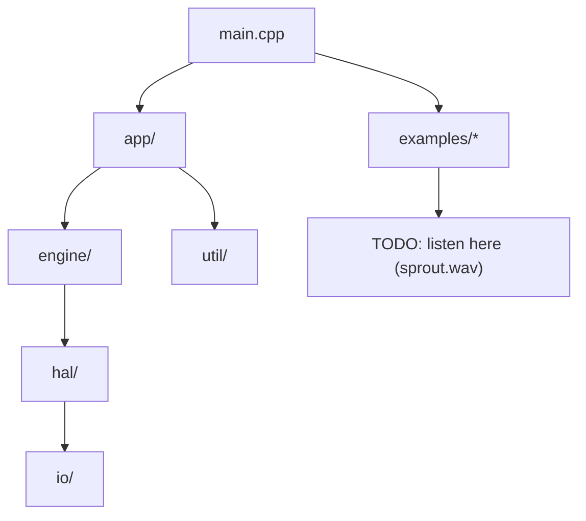

# SeedBox source tree — story mode

Welcome to the part of the project where ideas turn into actual code. This
folder is organized so you can read it like a workshop logbook: short riffs,
plenty of breadcrumbs, and room to sketch your own experiments.

## Map of the land

| Folder | What you'll find | Why it matters |
| --- | --- | --- |
| `app/` | High-level conductors like `AppState` and UI snapshot helpers. | Keeps the instrument's mood steady and understandable. |
| `engine/` | Audio engines (sampler stubs today, more wild stuff tomorrow). | Where seeds become sound textures. |
| `io/` | MIDI, display, codec glue — all the hardware conversations. | Lets the same code behave on laptop + Teensy. |
| `profiles/` | Seed recipes and macro maps. | Defines what a "granular seed" or other persona means. |
| `util/` | Tiny helpers, timers, deterministic RNG, logging. | The toolbox for everyone else. |
| `hal/` | Audio + IO seams. | Keeps timing rules documented and mockable. |
| `interop/` | Shared constants for MN42, MIDI, etc. | See [docs/interop_mn42.md](../docs/interop_mn42.md). |
| `main.cpp` | A thin doorway into the whole system. | Chooses native vs hardware boot and hands off to `app/`. |

Each subfolder tries to self-document. If you add something new, drop a short
comment or mini README nearby so the next curious hacker can follow along.

## Working here without stress

- **Trace the flow**: Start at `main.cpp`, hop into `app/`, then explore engines
  and IO as you need. It's okay to treat it like a choose-your-own-adventure.
- **Respect quiet mode**: `QUIET_MODE` is honoured across the tree. Examples keep
  it enabled; hardware boots with it off. Flip it consciously and document why.
- **Mirror changes in tests**: Most logic has a friend in `test/`. When you tweak
  behavior, update the matching test so the intent stays obvious.
- **Keep hardware flags gentle**: Wrap Teensy-only code in `#ifdef SEEDBOX_HW`
  so the `native` build stays a truthful simulator.

## When you extend the story

1. Sketch the idea in words first (README, doc comment, or a quick diagram).
2. Build the behavior in code.
3. Capture the lesson in a test or example so future readers see it in action.
   Crosslink to [tests/native_golden](../tests/native_golden/README.md) when the
   change affects audio output (TODO: golden hashes still pending).

**TODO: listen here** markers throughout the repo point to future WAV clips.
Once golden fixtures exist, link this README to the canonical renders from
`examples/01_sprout`, `examples/02_reseed`, and `examples/03_headless`.

Think of `src/` as the main stage and everything else as the backstage crew. The
show goes best when the set list is clear and the amps aren't humming.
