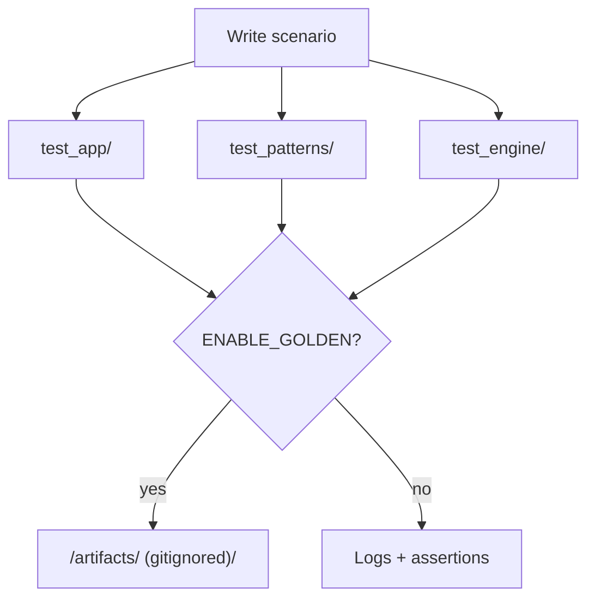

# Test harness — keeping the seeds honest (and fun)

Welcome to the safety net. These tests run in the `native` PlatformIO
environment so you can check ideas on a laptop before ever touching hardware.
Think of this folder as the detective agency for your audio experiments.



## What's where

| Folder | Focus | Why you should care |
| --- | --- | --- |
| `test_app/` | Covers `AppState`, reseeding rituals, display snapshots. | Stops UI lies before they hit the OLED. |
| `test_patterns/` | Stresses the scheduler, tick math, and trigger ordering. | Keeps rhythms tight even after wild refactors. |
| `test_engine/` | Exercises DSP helpers and seed-to-sound flows. | Generates bite-sized reproducible examples for docs. |

Everything uses Unity (the test framework bundled with PlatformIO), which keeps
setup light and failure messages readable.

## Run the whole suite

```bash
pio test -e native
```

That command is the heartbeat of the project. Run it whenever you touch `src/`
or `include/` code.

### Toggle-able test flags

- `ENABLE_GOLDEN` — When set, tests can record fresh comparison data into
  `artifacts/`. Commit the intent in docs, not the raw files, so the repo stays
  lean.
- `QUIET_MODE` — Suppresses log spam while still running assertions. Handy when
  you're generating `.wav` snippets into `out/` for listening tests.

Hardware-specific branches in tests are still wrapped in `SEEDBOX_HW`, even if
we mostly run the suite on laptops.

## Writing new tests without dread

- Narrate your intent with comments. Leave breadcrumbs for the next late-night
  debugger.
- Use explicit seed values so failures are repeatable.
- If you discover a hardware-only quirk, recreate it here with a mocked
  dependency and document the original scenario in `docs/`.

Need more narrative? Cross-reference the [docs roadmap](../docs/roadmaps) or the
[source tour](../src/README.md) and link the sections you touched right inside
your test file comments.

Healthy tests let us stay bold with the music experiments.
