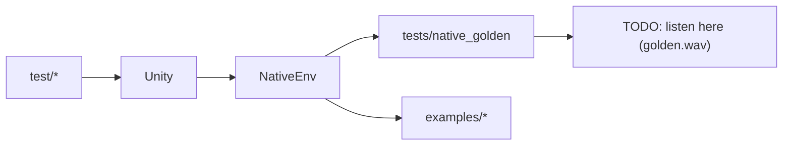

# Test harness — keeping the seeds honest (and fun)

Welcome to the safety net. These tests run in the `native` PlatformIO
environment so you can check ideas on a laptop before ever touching hardware.
Think of this folder as the detective agency for your audio experiments.



## What's where

| Folder | Focus | Why you should care |
| --- | --- | --- |
| `test_app/` | Covers `AppState`, reseeding rituals, display snapshots. | Stops UI lies before they hit the OLED. |
| `test_patterns/` | Stresses the scheduler, tick math, and trigger ordering. | Keeps rhythms tight even after wild refactors. |
| `native_golden/` | Placeholder golden-audio harness. | See [../tests/native_golden/README.md](../tests/native_golden/README.md). |

Everything uses Unity (the test framework bundled with PlatformIO), which keeps
setup light and failure messages readable.

## Run the whole suite

```bash
pio test -e native
```

That command is the heartbeat of the project. Run it whenever you touch `src/`
or `include/` code.

Want a deeper dive? Pair these tests with the playable examples:

- [Example 01 — sprout](../examples/01_sprout/README.md)
- [Example 02 — reseed ritual](../examples/02_reseed/README.md)
- [Example 03 — headless loop](../examples/03_headless/README.md)

## Writing new tests without dread

- Narrate your intent with comments. Leave breadcrumbs for the next late-night
  debugger.
- Use explicit seed values so failures are repeatable.
- If you discover a hardware-only quirk, recreate it here with a mocked
  dependency and document the original scenario in `docs/`.
- Golden harness tip: define `-D ENABLE_GOLDEN=1` only when you've generated new
  WAVs (TODO: capture them in a future release). The default path keeps CI fast
  and deterministic.

Healthy tests let us stay bold with the music experiments.
