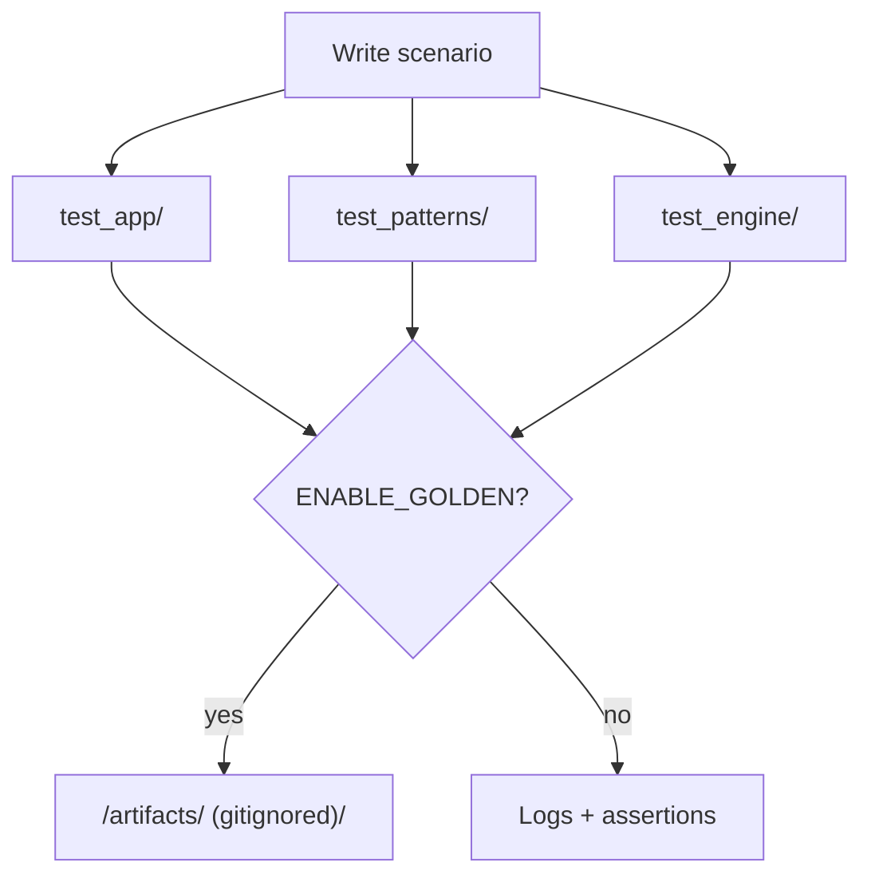

# Test harness — keeping the seeds honest (and fun)

Welcome to the safety net. These tests run in the `native` PlatformIO
environment so you can check ideas on a laptop before ever touching hardware.
Think of this folder as the detective agency for your audio experiments.



## What's where

| Folder | Focus | Why you should care |
| --- | --- | --- |
| `test_app/` | Covers `AppState`, reseeding rituals, display snapshots, and the scripted panel walkthrough. | Stops UI lies before they hit the OLED and doubles as a front-panel rehearsal. |
| `test_patterns/` | Stresses the scheduler, tick math, trigger ordering, plus the BPM/swing golden captures. | Keeps rhythms tight even after wild refactors and documents exactly where each tick lands. |
| `test_engine/` | Exercises DSP helpers and seed-to-sound flows, including Euclid/Burst postcard renders. | Generates bite-sized reproducible examples for docs and fixture updates. |
| `test_util/` | Utility math, quantizers, and helpers that glue the UI to DSP bits. | Gives reusable primitives regression coverage so experiments stay deterministic. |
| `native_golden/` | Deterministic audio renders and manifest checks. | Publishes sonic receipts for every merge. |

Everything uses Unity (the test framework bundled with PlatformIO), which keeps
setup light and failure messages readable.

## Run the whole suite

```bash
pio test -e native
```

That command is the heartbeat of the project. Run it whenever you touch `src/`
or `include/` code.

### Toggle-able test flags

Defaults for every switch live in [`include/SeedBoxConfig.h`](../include/SeedBoxConfig.h).

- `ENABLE_GOLDEN` — When set, tests can record fresh comparison data into
  `artifacts/`. Commit the intent in docs, not the raw files, so the repo stays
  lean. Fire up the `native_golden` PlatformIO env to toggle it without
  juggling manual build flags. PlatformIO feeds the project path in as
  `SEEDBOX_PROJECT_ROOT_HINT`, the harness respects a runtime
  `SEEDBOX_PROJECT_ROOT` override, and it still walks up the filesystem hunting
  for `platformio.ini` if all else fails. The rendered WAVs always land in
  `<repo>/build/fixtures` even though the binary runs inside `.pio/`. Override
  that default with `SEEDBOX_FIXTURE_ROOT=/tmp/seedbox-fixtures` if you're
  prototyping somewhere else.
- `QUIET_MODE` — Suppresses log spam while still running assertions. Handy when
  you're generating `.wav` snippets into `out/` for listening tests.

Hardware-specific branches in tests are still wrapped in `SEEDBOX_HW`, even if
we mostly run the suite on laptops.

## Fresh lab notes

- **Front panel story time:** `tests/test_app/test_app.cpp` now contains
  `test_scripted_front_panel_walkthrough`, a soup-to-nuts rehearsal that hits
  mode changes, reseeds, locks, and preset recall using nothing but the native
  board shim. Run it solo with:

  ```bash
  pio test -e native --filter test_app --test-name test_scripted_front_panel_walkthrough
  ```

- **Clock goldens:** `tests/test_patterns/test_tick_golden.cpp` captures tick
  logs for 60/90/120 BPM at multiple swing percentages. Regenerate the
  `artifacts/pattern_ticks_*.txt` fixtures by flipping `ENABLE_GOLDEN`:

  ```bash
  pio test -e native_golden --filter test_patterns --test-name test_clock_tick_log_golden
  ```

- **Engine postcards:** `tests/test_engine/test_euclid_burst.cpp` now writes
  Euclid and Burst display snapshots when `ENABLE_GOLDEN` is set. Peek at
  `artifacts/engine_snapshots.txt` whenever you need doc-ready screenshots of
  the status text.
- **Teensy granular probes:** `tests/test_hardware/` adds the first
  hardware-only assertions around `AudioEffectGranular`'s `beginPitchShift()`
  fallback and the mixer fan-out wiring. Flash them with `pio test -e teensy40
  --filter test_hardware`, then drop the serial log in
  [`docs/hardware/granular_probes/`](../docs/hardware/granular_probes/README.md)
  so the scratchpad findings get receipts.

## Writing new tests without dread

- Narrate your intent with comments. Leave breadcrumbs for the next late-night
  debugger.
- Use explicit seed values so failures are repeatable.
- If you discover a hardware-only quirk, recreate it here with a mocked
  dependency and document the original scenario in `docs/`.

Need more narrative? Cross-reference the [docs roadmap](../docs/roadmaps) or the
[source tour](../src/README.md) and link the sections you touched right inside
your test file comments.

Healthy tests let us stay bold with the music experiments.
