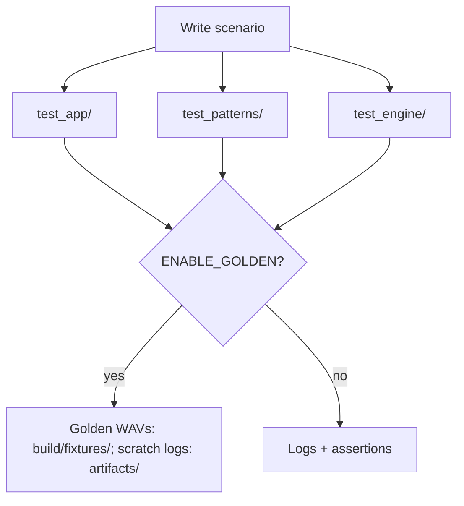

# Test harness — keeping the seeds honest (and fun)

Welcome to the safety net. These tests run in the `native` PlatformIO
environment so you can check ideas on a laptop before ever touching hardware.
Think of this folder as the detective agency for your audio experiments.

If you want the public framing around proof and trust before diving into test
targets:

- [Seed gallery](../docs/SeedGallery.md)
- [Stability and support](../docs/StabilityAndSupport.md)


```mermaid
flowchart TD
  Start[Write scenario] --> Cases[test_app/]
  Start --> Patterns[test_patterns/]
  Start --> Engines[test_engine/]
  Cases --> Golden{ENABLE_GOLDEN?}
  Patterns --> Golden
  Engines --> Golden
  Golden -->|yes| Artifacts["Golden WAVs: build/fixtures/; scratch logs: artifacts/"]
  Golden -->|no| Console["Logs + assertions"]
```

## What's where

| Folder | Focus | Why you should care |
| --- | --- | --- |
| `test_app/` | Covers `AppState`, reseeding rituals, display snapshots, and the scripted panel walkthrough. | Stops UI lies before they hit the OLED and doubles as a front-panel rehearsal. |
| `test_patterns/` | Stresses the scheduler, tick math, trigger ordering, plus the BPM/swing golden captures. | Keeps rhythms tight even after wild refactors and documents exactly where each tick lands. |
| `test_engine/` | Exercises DSP helpers and seed-to-sound flows, including Euclid/Burst postcard renders. | Generates bite-sized reproducible examples for docs and fixture updates. |
| `test_util/` | Utility math, quantizers, and helpers that glue the UI to DSP bits. | Gives reusable primitives regression coverage so experiments stay deterministic. |
| `native_golden/` | Deterministic audio renders and manifest checks. | Publishes sonic receipts for every merge. |

Everything uses Unity (the test framework bundled with PlatformIO), which keeps
setup light and failure messages readable.

## Run the whole suite

```bash
pio test -e native
```

Use `--filter test_app` or `--filter test_engine` to select a suite directory.
The suite entry points invoke their registered Unity tests; `--test-name` is
not a supported PlatformIO option.

### Toggle-able test flags

Defaults for every switch live in [`include/SeedBoxConfig.h`](../include/SeedBoxConfig.h).

- `ENABLE_GOLDEN` — Enables golden capture. The `native_golden` environment
  sets it for you. Curated WAVs and control ledgers live in `build/fixtures/`;
  tick-debug logs written to `artifacts/` are disposable. Follow the
  [artifact policy](../docs/artifact_policy.md) when refreshing references.
  `SEEDBOX_PROJECT_ROOT_HINT` supplies the project root; a runtime
  `SEEDBOX_PROJECT_ROOT` override is also supported. Use `SEEDBOX_FIXTURE_ROOT`
  to send experimental renders to a temporary directory.
- `QUIET_MODE` — Suppresses log spam while still running assertions. Handy when
  you're generating `.wav` snippets into `out/` for listening tests.

Hardware-specific branches in tests are still wrapped in `SEEDBOX_HW`, even if
we mostly run the suite on laptops.

## Fresh lab notes

- **Front panel story time:** `tests/test_app/test_app.cpp` now contains
  `test_scripted_front_panel_walkthrough`, a soup-to-nuts rehearsal that hits
  mode changes, reseeds, and preset recall using nothing but the native
  board shim. Run its containing suite with:

  ```bash
  pio test -e native --filter test_app
  ```

- **Clock goldens:** `tests/test_patterns/test_tick_golden.cpp` captures tick
  logs for 60/90/120 BPM at multiple swing percentages. Regenerate the
  `artifacts/pattern_ticks_*.txt` fixtures by flipping `ENABLE_GOLDEN`:

  ```bash
  pio test -e native_golden --filter test_patterns
  ```

- **Engine postcards:** `tests/test_engine/test_euclid_burst.cpp` now writes
  Euclid and Burst display snapshots when `ENABLE_GOLDEN` is set. Peek at
  `artifacts/engine_snapshots.txt` whenever you need doc-ready screenshots of
  the status text.
- **Teensy granular probes:** `tests/test_hardware/` adds the first
  hardware-only assertions around `AudioEffectGranular`'s `beginPitchShift()`
  fallback and the mixer fan-out wiring. Flash them with `pio test -e teensy40
  --filter test_hardware`, then drop the serial log in
  [`docs/hardware/granular_probes/`](../docs/hardware/granular_probes/README.md)
  so the scratchpad findings get receipts.

## Writing new tests without dread

- Narrate your intent with comments. Leave breadcrumbs for the next late-night
  debugger.
- Use explicit seed values so failures are repeatable.
- If you discover a hardware-only quirk, recreate it here with a mocked
  dependency and document the original scenario in `docs/`.

Need more narrative? Cross-reference the [docs roadmap](../docs/roadmaps) or the
[source tour](../src/README.md) and link the sections you touched right inside
your test file comments.

Healthy tests let us stay bold with the music experiments.

## Front-panel contract

[SB-04](../docs/roadmaps/SB-04-panel-contract-tests.md) documents the compile-time
pin/coverage guards, documentation checker and negative tests, scripted tests
for all eight switches and four encoders, and the offscreen JUCE CTest. The
scripted controls run in `pio test -e native --filter test_app`; they verify each
control independently so one event cannot hide activity on another control.
