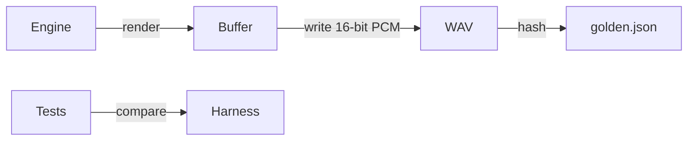

# Native golden harness (stubbed for now)

This folder sets up deterministic audio renders without shipping any audio yet.
Future passes will drop 1–2 s WAVs here and hash them for regression tests.

## How it will work

1. Use the native build to render short fixtures (sprout pattern, reseed cadence).
2. Dump 16-bit PCM WAVs via `writeWav16` (currently a stub).
3. Hash the files (SHA-256) and update `golden.json`.
4. Re-run tests with `-D ENABLE_GOLDEN=1` to verify nothing drifted.

## TODOs before we flip the switch

- TODO: Implement `writeWav16` to stream to disk without dynamic allocation.
- TODO: Author render routines for sprout/reseed fixtures (1–2 seconds each).
- TODO: Store WAVs in `/out/golden/` (ignored by git) and document how to refresh.
- TODO: Publish "listen here" links once clips exist.

Until then the Unity test marks itself ignored unless `ENABLE_GOLDEN` is defined.
